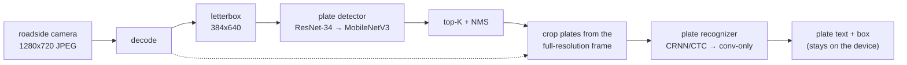
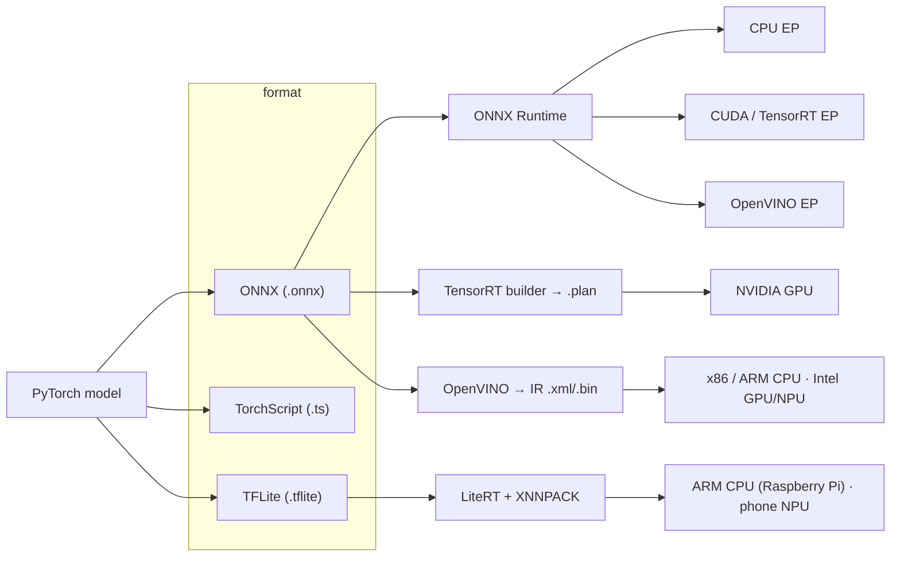
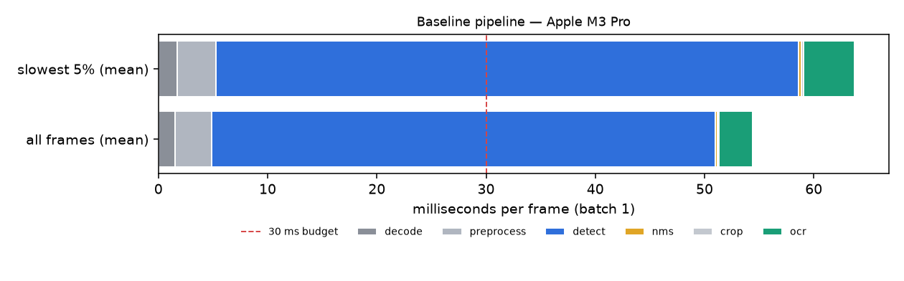

# ANPR on the Edge — Model Optimization & Efficient Inference (Session 5)

A licence plate recognition pipeline works on a server GPU. Now it has to run on a
**roadside box** — Jetson-class or a Raspberry Pi — inside **30 ms per frame, with no
cloud uplink**: privacy law keeps the frames on the device, and rural sites have no
reliable connection anyway. This session takes that one pipeline from its server-GPU
prototype to the edge, one optimization at a time, measuring every step with the same
harness — and closes by stating, from the measurements, whether the budget was met.

Sessions 1–4 built, deployed and monitored a model. Session 5 is what happens when the
model is right but too slow, too big or too expensive to run where it is needed.



**The same three words mean three different things** — keep them apart for the whole session
([guide 03](guides/03-formats-runtimes-backends.md)):



ONNX is a **format**. ONNX Runtime, TensorRT and OpenVINO are **runtimes**. CPU, CUDA, TensorRT
and OpenVINO execution providers — and the hardware under them — are **backends**.
"ONNX is slow" names none of the three.

### Contents

- [The case study and the five metrics](#the-case-study-and-the-five-metrics)
- [Project structure](#project-structure)
- [Setup — three verified paths](#setup--three-paths) · [Compatibility matrix](#compatibility-matrix)
- [Profile first](#profile-first--s00)
- [The optimization journey, stage by stage](#the-optimization-journey)
- [The journey table](#the-journey-table) · [Did we meet 30 ms?](#did-we-meet-30-ms)
- [Which path do I take?](#which-path-do-i-take) · [What it costs for a fleet](#what-it-costs-for-a-fleet-of-cameras)
- [Exercises](#exercises) · [Troubleshooting](#troubleshooting--the-errors-you-will-actually-hit)
- [Running it on the RTX 3090](#running-it-on-the-rtx-3090) · [Where this fits](#where-this-fits)

**Guides** — every one follows the same seven sections (problem, mental model, walkthrough,
measured result, gotchas, AV comparison, when not to use it):

| # | Guide | Stage |
|---|---|---|
| 00 | [Profile first](guides/00-profile-first.md) | `s00` |
| 01 | [Why optimize](guides/01-why-optimize.md) | — |
| 02 | [Benchmarking properly](guides/02-benchmarking-properly.md) | harness, `s01` |
| 03 | [Formats, runtimes, backends](guides/03-formats-runtimes-backends.md) | — |
| 04 | [torch.compile and TorchScript](guides/04-torch-compile-and-torchscript.md) | `s02`, `s03` |
| 05 | [ONNX and execution providers](guides/05-onnx-and-execution-providers.md) | `s04` |
| 06 | [Pruning](guides/06-pruning.md) | `s05` |
| 07 | [Quantization: PTQ and QAT](guides/07-quantization-ptq-qat.md) | `s06a`, `s06b` |
| 08 | [When INT8 breaks](guides/08-when-int8-breaks.md) | `int8-debug` |
| 09 | [Knowledge distillation](guides/09-knowledge-distillation.md) | `s07` |
| 10 | [TensorRT](guides/10-tensorrt.md) | `s08` |
| 11 | [Triton Inference Server](guides/11-triton-inference-server.md) | `s11` |
| 12 | [OpenVINO](guides/12-openvino.md) | `s09` |
| 13 | [TFLite and the edge](guides/13-tflite-and-edge.md) | `s10` |
| 14 | [LLM serving: same levers](guides/14-llm-serving-same-levers.md) | — |
| 15 | [Optimization in your MLOps stack](guides/15-optimization-in-your-mlops-stack.md) | `ci/` |
| 16 | [Decision guide](guides/16-decision-guide.md) | — |

---

## The case study and the five metrics

**One system, end to end.** A plate **detector** — single-class, anchor-free, one stride-8
output level ([`src/models/detector.py`](src/models/detector.py)) — finds plates in a road
scene; a **CRNN/CTC recognizer** ([`src/models/ocr.py`](src/models/ocr.py)) reads the crop.
Both are written in this repo and trained from scratch on synthetic frames tagged `day`,
`night`, `rain`, `motion_blur` and `low_contrast` ([`data/README.md`](data/README.md) —
why synthetic, and the licence of every alternative). Every stage optimizes *this*
pipeline; other computer-vision models appear only as short comparison callouts in the guides.

Every row of results records **five metrics**, because three is not enough:

| Metric | Definition | Why it is here |
|---|---|---|
| **Accuracy** | detector mAP@0.5 **and** plate-level OCR exact match, overall and per condition | INT8 can leave every box in place while the characters inside stop reading correctly |
| **Latency** | end-to-end p50/p95 per frame at batch 1, plus per phase: decode → preprocess → detect → NMS → crop → OCR | the SLA is a tail percentile of the whole pipeline, not the model's mean |
| **Throughput** | frames/s at the saturating batch size, and the curve | capacity planning runs on throughput |
| **Size** | on-disk size of the whole pipeline's artifacts | download over a thin rural link; flash on the box |
| **Peak memory** | peak RSS (CPU) and peak VRAM (GPU) during inference | "fits on the device" is decided by memory, not file size |

Plus a derived **cost per million frames** from [`src/cost.py`](src/cost.py) (formula below).

## Project structure

```
session_5/
├── Makefile                      # one target per stage; `make help`
├── pyproject.toml                # ranges + ruff; exact pins live in requirements*.txt
├── requirements.txt              # CPU stack (torch 2.13, ORT 1.30, torch-pruning, tritonclient)
├── requirements-openvino.txt     # OpenVINO 2026.3 + NNCF 3.3 (same venv)
├── requirements-gpu.txt          # Linux + NVIDIA: torch cu130, onnxruntime-gpu, TensorRT 10.16
├── requirements-edge.txt         # onnx2tf + LiteRT — a SEPARATE venv (conflicting pins)
├── data/README.md                # provenance + licences; synthetic data is generated into data/synthetic/
├── src/
│   ├── config.py                 # single source of truth: geometry, thresholds, SLA, profiles, threads
│   ├── benchmark.py              # THE harness — nothing else times anything
│   ├── backends.py               # one thin adapter per runtime (torch, torchscript, ort, openvino, tflite, tensorrt, triton)
│   ├── pipeline.py               # the six phases, no timing code; pipeline_gpu.py / pipeline_remote.py variants
│   ├── parity.py                 # export parity gate: tensors, boxes, strings
│   ├── cost.py                   # cost per million frames, fleet sizing
│   ├── environment.py            # hardware, versions, thread knobs, load average — recorded per row
│   ├── results.py                # results.json read/write (code only)
│   ├── metrics.py                # mAP@0.5, plate exact match, per condition
│   ├── preprocess.py · postprocess.py   # numpy/Pillow only: no torch import in non-torch pipelines
│   ├── models/                   # detector.py, ocr.py, io.py (checkpoints)
│   ├── datasets/                 # synthetic.py, splits.py (hash-verified), calibration.py, torch_data.py, ccpd.py
│   ├── train.py · losses.py      # training loops the stages reuse
│   ├── quant_debug.py            # the INT8 debugging loop (make int8-debug)
│   └── stages/                   # s00_profile.py … s11_triton.py
├── guides/                       # 00–16, one per topic
├── triton_serving/               # NOT triton/ — see troubleshooting #1
│   ├── model_repository/         # detector, detector_nobatch, detector_nms, ocr, anpr (Python BLS)
│   └── client.py                 # HTTP + gRPC proof that the server serves the pipeline
├── ci/                           # perf_gate.py, shadow_compare.py, benchmark card template, docker/Dockerfile.gpu
├── tools/                        # journey_table, render_results, benchmark_card, doctor, check_exercises
├── tests/                        # KD maths, cost, NMS/CTC/metrics, parity gate, pruning exclusion, repo hygiene
└── results/                      # results.json (machine-written), journey_table.md, profile/, int8_debug/, cards/
```

The GitHub Actions workflow is at the repo root, [`../.github/workflows/session5-perf-gate.yml`](../.github/workflows/session5-perf-gate.yml) — GitHub only runs workflows from there.

## Setup — three paths

Python **3.12** on every path (onnxruntime 1.30 needs ≥ 3.11, onnx2tf 2.6 needs ≥ 3.12,
the Triton 26.05 container runs 3.12).

### A. CPU only — any laptop. This is the path the committed results were produced on.

```bash
cd session_5
make setup              # .venv + requirements.txt + requirements-openvino.txt
make setup-edge         # .venv-edge for s10 (onnx2tf/LiteRT pins conflict with the main stack)
make doctor             # PASS/FAIL/WARN checklist; WARN = a stage that will record not_run
make profile            # data -> train -> s00: the baseline breakdown, before you read anything
make all                # every stage; GPU-only rows are recorded as not_run with the reason
```

`ANPR_PROFILE=ci` shrinks data and epochs to a few minutes for a smoke run;
`quick` (default) is what the committed CPU results use; `full` is for the GPU.
Training uses CUDA, then Apple MPS, then CPU — whichever exists. **Benchmarks** run on CPU
unless a CUDA device exists; a missing GPU never crashes a stage.

### B. One NVIDIA GPU — the course's RTX 3090 (Ampere), Ubuntu

```bash
nvidia-smi                          # driver R580 or newer (CUDA 13.x)
make setup && make setup-edge
make setup-gpu                      # swaps onnxruntime -> onnxruntime-gpu, adds torch cu130 + TensorRT 10.16.1.11
make doctor                         # must show the CUDA device, TensorRT 10.16, CUDAExecutionProvider
ANPR_PROFILE=full make all
```

Or build and run everything inside the pinned container (same TensorRT as the Triton image):

```bash
docker build -f ci/docker/Dockerfile.gpu -t anpr-gpu:26.05 .
docker run --rm --gpus all -v "$PWD":/workspace/session_5 anpr-gpu:26.05 make all
```

> **Status of this path.** The GPU code paths (CUDA/TensorRT execution providers, TensorRT
> engines and calibrator, nvJPEG decode, VRAM sampling) are written against the pinned
> versions below, but the committed results were produced on a CPU machine, so those rows
> read `not_run` until a GPU run records them. Run it, commit `results/results.json`, and
> `make table` puts the 3090's table next to the laptop's.

### C. Docker for Triton (`make s11`)

```bash
docker pull nvcr.io/nvidia/tritonserver:26.05-py3     # arm64 and amd64 manifests; large download
# NVIDIA box: install the NVIDIA Container Toolkit so `docker run --gpus all` works
make s11                                              # populates the repository, starts the server, proves it, measures
make triton-down
```

### Compatibility matrix

Every version below was installed together or checked against the vendor's release notes on 2026-09-13.

| Component | Pinned | Why this one |
|---|---|---|
| Python | 3.12 | the only version every stage agrees on |
| torch / torchvision | 2.13.0 / 0.28.0 (`+cu130` on the GPU box) | the newest `litert-torch` accepts ([PyPI](https://pypi.org/pypi/litert-torch/json)); cu130 wheels exist for 2.13 ([index](https://download.pytorch.org/whl/cu130/torch/)) |
| ONNX / opset | onnx 1.22.0 · **opset 18** | opset 18 is accepted by ORT 1.24 (inside Triton 26.05), TensorRT 10.16, OpenVINO 2026 and onnx2tf |
| ONNX Runtime | 1.30.0 (CPU) · onnxruntime-gpu 1.30.0 | the GPU wheel's TensorRT EP links `libnvinfer.so.10` ([PyPI](https://pypi.org/pypi/onnxruntime-gpu/json)) |
| CUDA / driver | CUDA 13.x · driver R580+ | [CUDA release notes](https://docs.nvidia.com/cuda/cuda-toolkit-release-notes/index.html) |
| TensorRT | **10.16.1.11** | the last TensorRT 10 in NGC (26.05): same version in `tensorrt:26.05-py3`, `tritonserver:26.05-py3` and pip. TensorRT 11 removed the implicit INT8 calibrator s08 teaches ([11.0 notes](https://docs.nvidia.com/deeplearning/tensorrt/latest/getting-started/release-notes-11/11.0.0.html)) |
| Triton | `nvcr.io/nvidia/tritonserver:26.05-py3` · tritonclient 2.72.0 | [26.05 release notes](https://docs.nvidia.com/deeplearning/triton-inference-server/release-notes/rel-26-05.html) |
| OpenVINO / NNCF | 2026.3.1 / 3.3.0 | `mo` and POT are gone; `ov.convert_model` + `nncf.quantize` |
| onnx2tf / LiteRT | 2.6.8 / ai-edge-litert 2.1.2 (separate venv) | onnx2tf pins onnx 1.20.1 and onnxruntime 1.26.0 exactly |
| torch-pruning | 1.6.1 (MIT) | physical channel removal with dependency tracking |
| Jetson (edge note) | JetPack 7.2: TensorRT 10.16.2, CUDA 13.2.1 | [JetPack 7.2](https://developer.nvidia.com/embedded/jetpack/downloads/archive-7.2) — rebuild engines on the device |

FP8 is out of scope: TensorRT supports FP8 convolution from Ada (SM 8.9) up ([10.3 notes](https://docs.nvidia.com/deeplearning/tensorrt/10.x.x/getting-started/release-notes-10/10.3.0.html)); the RTX 3090 is Ampere (SM 8.6).

---

## Profile first — `s00`

**You do not touch the model until you have attributed the latency.** In a real ANPR
pipeline, JPEG decode, resize, NMS, cropping and serialization can rival the model — and a
student who quantizes first can spend a week moving a small slice of the p95.

`make profile` measures the baseline pipeline with the harness, draws where every
millisecond goes for the median frame *and* for the slowest 5%, runs `torch.profiler` inside
the model phases, and applies the gate in [`src/stages/s00_profile.py`](src/stages/s00_profile.py)
(`snippet:profile-gate`): if the two models are under half of the p95 tail, the first fixes
are in preprocessing and I/O. It measures three such fixes regardless — exact-factor resize,
NMS inside the graph, nvJPEG decode on the GPU — so the verdict is backed by rows either way.

<!-- results:gate -->
<!-- /results -->



The chart above is this repository's committed CPU run; `make s00` writes one per machine into `results/profile/`.
Details and Nsight/py-spy notes: [guide 00](guides/00-profile-first.md).

## The optimization journey

The stages are a **tree, not a chain.** Each row names the artifact it was built from
(`parent`), and the journey table renders that lineage — the TensorRT engine built from the
distilled student does not contain the pruning rows printed above it.

| Stage | Make | Built from | Kind |
|---|---|---|---|
| `s00` profile + pre/post-processing fixes | `make s00` | baseline | branch |
| `s01` baseline — eager PyTorch FP32 | `make s01` | — | root |
| `s02` torch.compile | `make s02` | baseline | branch |
| `s03` TorchScript | `make s03` | baseline | branch (export) |
| `s04` ONNX + execution providers | `make s04` | baseline | main |
| `s05` pruning: masked vs sliced | `make s05` | baseline / s04 | branch |
| `s06a` PTQ · `int8-debug` · `s06b` QAT | `make s06a int8-debug s06b` | s04 | branch |
| `s07` distillation → the edge student | `make s07` | baseline | **main** |
| `s08` TensorRT | `make s08` | s07 student ONNX | main (GPU) |
| `s09` OpenVINO | `make s09` | s07 student ONNX | main (CPU) |
| `s10` TFLite / LiteRT | `make s10` | s07 student ONNX | main (edge) |
| `s11` Triton | `make s11` | s07 student ONNX | serving |

**s00 — profile first.** Attribute the latency before optimizing anything; measure fast
resize, in-graph NMS and GPU decode as branches. → [guide 00](guides/00-profile-first.md) · [`s00_profile.py`](src/stages/s00_profile.py)

**s01 — baseline.** ResNet-34 detector + BiLSTM CRNN, eager FP32, Python NMS. The row every
delta is measured against. → [guide 02](guides/02-benchmarking-properly.md) · [`s01_baseline.py`](src/stages/s01_baseline.py)

**s02 — torch.compile.** The first thing to try, because it is one line; its cost shows up
in each row's `process_first_call_ms` (the first call of a fresh process). → [guide 04](guides/04-torch-compile-and-torchscript.md) · [`s02_torch_compile.py`](src/stages/s02_torch_compile.py)

**s03 — TorchScript.** An export and serving-compatibility format now, not an optimizer; the
stage records the warnings `torch.jit` actually raises. → [guide 04](guides/04-torch-compile-and-torchscript.md) · [`s03_torchscript.py`](src/stages/s03_torchscript.py)

**s04 — ONNX and execution providers.** One export, gated against PyTorch, run under every
ONNX Runtime provider the machine has — how most teams actually ship. → [guide 05](guides/05-onnx-and-execution-providers.md) · [`s04_onnx_export.py`](src/stages/s04_onnx_export.py)

**s05 — pruning.** Masked pruning first, to show that zeros stored densely change neither
size nor speed; then physical channel slicing, one-shot vs iterative, and a slice down to
the distillation student's parameter budget. → [guide 06](guides/06-pruning.md) · [`s05_pruning.py`](src/stages/s05_pruning.py)

**s06a / int8-debug / s06b — quantization.** Dynamic and static PTQ, a stratified vs a
daytime-only calibration set, per-tensor vs per-channel, and one model at a time so the loss has an
address; then the debugging loop when INT8 hurts (sensitivity ranked by what the pipeline outputs,
outliers, mixed precision) and QAT on the recognizer. The detector's box decode gets its own rows:
quantizing that arithmetic is what costs this pipeline its plate readings. → [guides 07](guides/07-quantization-ptq-qat.md), [08](guides/08-when-int8-breaks.md) · [`s06a_ptq.py`](src/stages/s06a_ptq.py), [`quant_debug.py`](src/quant_debug.py), [`s06b_qat.py`](src/stages/s06b_qat.py)

**s07 — distillation.** A MobileNetV3-Small detector and a conv-only recognizer taught by the
baseline, with temperature only where there is a softmax — and, for the recognizer, only after
measuring that teacher and student place characters in the same time steps. The distilled pair is
what every later stage deploys. → [guide 09](guides/09-knowledge-distillation.md) · [`s07_distillation.py`](src/stages/s07_distillation.py)

**s08 — TensorRT.** Engines from ONNX at FP32/FP16/INT8, the INT8 calibrator on our
calibration sets, shape profiles, layer inspection. NVIDIA GPU only. → [guide 10](guides/10-tensorrt.md) · [`s08_tensorrt.py`](src/stages/s08_tensorrt.py)

**s09 — OpenVINO.** IR conversion, NNCF INT8, latency vs throughput hints, the async queue,
and the "edge candidate" row where every fix that composes is combined. → [guide 12](guides/12-openvino.md) · [`s09_openvino.py`](src/stages/s09_openvino.py)

**s10 — TFLite / LiteRT.** onnx2tf and its real pain, full-integer INT8 with representative
data, INT8 input/output tensors. → [guide 13](guides/13-tflite-and-edge.md) · [`s10_tflite_edge.py`](src/stages/s10_tflite_edge.py)

**s11 — Triton.** The pipeline as a service: model repository, server-side detect → crop → OCR
via BLS, dynamic batching on vs off, versioning and hot reload, HTTP and gRPC proof. → [guide 11](guides/11-triton-inference-server.md) · [`s11_triton.py`](src/stages/s11_triton.py)

---

## The journey table

Generated from [`results/results.json`](results/results.json) by `make table` — never
hand-edited. Each machine gets its own table, with the hardware, thread settings, batch size
and library versions stated directly above it. `—` is a stage that did not run here; its
status column says why. The full file, with lineage diagrams, is [`results/journey_table.md`](results/journey_table.md).

<!-- results:journey -->
<!-- /results -->

## Did we meet 30 ms?

Answered from the rows above, per machine — the fastest row whose accuracy stays within the
SLA's allowed drop from the baseline, and whether that machine *is* the roadside box:

<!-- results:verdict -->
<!-- /results -->

A development laptop meeting the budget is evidence, not proof: the SLA is defined on the
roadside box. The Raspberry Pi row in `s10` and a Jetson run of `s08` are what close the
question; until they are measured, the honest answer for the target is "not measured".

## Which path do I take?

| Deployment target | Start with | Read these rows | Guide |
|---|---|---|---|
| Raspberry Pi 5 / ARM CPU, no accelerator | s00 → s07 distill → s10 full-integer INT8 (or s09 OpenVINO on ARM) | `s10_tflite_edge:*`, `s09_openvino:edge-candidate` | [13](guides/13-tflite-and-edge.md) |
| x86 roadside box, CPU only | s00 → s07 → s09 NNCF INT8 + edge candidate | `s09_openvino:*`, `s06a_ptq:*` | [12](guides/12-openvino.md) |
| Jetson Orin | s07 → s08 TensorRT FP16, then INT8 with calibration — **built on the Jetson** | `s08_tensorrt:*` | [10](guides/10-tensorrt.md) |
| Central GPU server for many cameras | s07 → s08 → s11 Triton with dynamic batching | `s11_triton:*`, `s08_tensorrt:*` | [11](guides/11-triton-inference-server.md) |
| Android / phone NPU, Apple devices | s07 → s10 LiteRT, or Core ML from torch.export | — | [16](guides/16-decision-guide.md) |

The full decision flow, with "symptom in the table → next lever", is [guide 16](guides/16-decision-guide.md).

## What it costs for a fleet of cameras

[`src/cost.py`](src/cost.py) turns measured throughput into money — the **formula**, never a hardcoded figure:

```
usable_fps        = highest frames/s on the measured curve whose p95 still meets the SLA
cost_per_million  = usd_per_hour / (usable_fps × 3600) × 1,000,000
instances         = ceil(cameras × camera_fps / usable_fps)
monthly_cost      = instances × usd_per_hour × 730
```

"Usable" is the point: a batch size that triples frames/s but blows the latency budget is
capacity you cannot use. For an edge box, `usd_per_hour` is the box's price amortized over
its service life plus its power draw, per hour. The journey table's `$/1M frames @ $1/h`
column is the formula at one dollar an hour — multiply by your own price.

```bash
# your prices, your fleet: 200 cameras at 5 frames/s, served by the s09 edge candidate
.venv/bin/python -m src.cost --row s09_openvino:edge-candidate --usd-per-hour <your $/h> --cameras 200 --camera-fps 5
```

## Exercises

Each has a mechanical acceptance check: `python -m tools.check_exercises <n>` prints PASS/FAIL with the evidence.

1. **Thread scaling.** Re-run `s04` with `ANPR_THREADS=1`. *Accept:* `s04_onnx_export:ort-cpu-fp32` exists at both 1 and 4 threads (they land in separate hardware groups). Explain the difference using the per-phase columns.
2. **Break calibration on purpose.** Add a `night` strategy to `src/datasets/calibration.py :: frames` and a matching row to `s06a` named `ort-static-int8-night`. *Accept:* the row is measured. Compare its per-condition exact match with the stratified and daytime rows.
3. **Masks vs slices, yourself.** Add a `sliced-oneshot-30` variant (30% of channels) to `s05`, with its ONNX row. *Accept:* `s05_pruning:sliced-oneshot-30-onnx` is smaller on disk than `s04_onnx_export:ort-cpu-fp32`.
4. **INT8 within budget.** Use `make int8-debug` and the mixed-precision or QAT row to bring OCR exact match within `SLA.max_ocr_em_drop` of FP32. *Accept:* check 4 passes.
5. **Watch the gate fail.** `make gate-demo`. *Accept:* `ci.perf_gate` exits 1 on the injected regression (check 5 re-runs it).
6. **Meet the SLA on your machine.** Combine stages until one row has p95 ≤ the SLA with accuracy inside the allowed drops. *Accept:* check 6 lists at least one row.
7. **Measure dynamic batching.** Run `make s11`. *Accept:* both `triton-grpc-client-pipeline` and `triton-grpc-nobatch` rows exist with throughput curves; explain the difference with the server's average batch size in the row notes.

## Troubleshooting — the errors you will actually hit

Every one of these was hit while building this session.

**1. `AttributeError: module 'triton' has no attribute 'language'`** on `import torchvision`.
A folder named `triton/` in your working directory shadows the `triton` package that
`torch._dynamo` imports. *Fix:* rename the folder — this repo uses `triton_serving/`.

**2. `Because onnx2tf==2.6.8 depends on onnxruntime==1.26.0 and you require onnxruntime==1.30.0 ... your requirements are unsatisfiable.`**
onnx2tf pins exact versions of onnx, onnxruntime and ai-edge-litert. *Fix:* `make setup-edge` — a separate `.venv-edge`.

**3. `ModuleNotFoundError: No module named 'tensorflow'`** from `import onnx2tf`.
An unpinned install resolved to an old onnx2tf (1.28.x) that imports TensorFlow. *Fix:* `onnx2tf==2.6.8`, whose default backend needs no TensorFlow.

**4. `FileNotFoundError: [Errno 2] No such file or directory: 'onnxsim'`** followed by `Failed to optimize the onnx file.`
onnx2tf shells out to the `onnxsim` CLI, which is only on PATH when the venv is activated. *Fix:* activate `.venv-edge`, or put its `bin/` on PATH (s10 does this for you).

**5. `quantized_dimension must be in range [0, 1). Was 3.`** (onnx2tf `StrictFullIntegerQuantizationError`).
Per-channel INT8 on Conv1d-derived tensors fails the strict full-integer validator. *Fix:* `quant_type="per-tensor"`.

**6. `tflite/kernels/conv.cc:360 input_type == kTfLiteFloat32 || ... was not true. Node number 0 (CONV_2D) failed to prepare.`**
The float16 `.tflite` from onnx2tf's direct writer keeps float16 input tensors, which LiteRT's convolution refuses. *Fix:* deploy the float32 or full-integer file; s10 records the float16 row as failed with this reason.

**7. `Exporting the operator 'aten::fused_moving_avg_obs_fake_quant' to ONNX opset version 18 is not supported`** — or, with the dynamo exporter, `TorchExportError: Failed to export the model with torch.export` pointing at `if self.observer_enabled[0] == 1`.
The default QAT qconfig uses fused fake-quantize modules, and FakeQuantize branches on a tensor value that `torch.export` cannot trace. *Fix:* the non-fused `FakeQuantize` qconfig in `snippet:qat-qconfig`, observers disabled, `dynamo=False` for that one export.

**8. `Exception: Incomplete symbolic shape inference`** from `onnxruntime.quantization.shape_inference.quant_pre_process`.
ORT's symbolic shape inference cannot follow the dynamo-exported graphs. *Fix:* `quant_pre_process(src, dst, skip_symbolic_shape=True)` — ONNX shape inference still runs, and node names and scope metadata survive.

**9. OCR training loss stuck near its starting value, `val_gt_crop_exact_match: 0.0`.**
CTC sits on an "all blanks" plateau for its first several hundred optimizer steps; a large batch on a small dataset gives too few steps to leave it. *Fix:* smaller batch / more epochs — `src/train.py :: fit_ocr` uses batch 32 for this reason.

**10. `RuntimeError: Tensor on device mps:0 is not on the expected device cpu!`** while exporting a model you just fine-tuned.
Training leaves the model on the training device (Apple MPS or CUDA) and the export example is a CPU tensor. *Fix:* `model.cpu().eval()` before saving and exporting — `src/stages/s05_pruning.py :: measure` does this.

Also worth knowing: `onnxruntime` and `onnxruntime-gpu` cannot be installed together (`make setup-gpu` removes one);
an ONNX Runtime session silently falls back to the next provider in its list — the harness records `active_providers` per row;
a TensorRT `.plan` built with a different TensorRT version or GPU model fails to deserialize — rebuild it where it runs;
`torch.save` on a `convert_fx` result fails with `AttributeError: 'str' object has no attribute '__name__'` — ship it as TorchScript (`snippet:qat-convert-deploy`);
on an ARM CPU, OpenVINO's default inference precision is `float16`, so an FP32 IR does not reproduce FP32 outputs until you set `INFERENCE_PRECISION_HINT` to `f32` (the s09 parity gate caught exactly this);
full-integer TFLite of the MobileNetV3 detector fails on `op_type=FILL` (a dynamic batch left in the graph — fix with `overwrite_input_shape`) and then on `op_type=RELU_0_TO_1` (hard-sigmoid, no full-integer kernel in onnx2tf 2.6.8);
and on macOS, a script piped into `python -` that starts DataLoader workers hangs with a traceback in `multiprocessing/spawn.py` — put it in a file under `if __name__ == "__main__":`.

## Running it on the RTX 3090

1. `nvidia-smi` shows driver ≥ R580; `docker run --rm --gpus all ubuntu nvidia-smi` works (Container Toolkit).
2. `make setup setup-edge setup-gpu && make doctor` — CUDA device, TensorRT 10.16, `CUDAExecutionProvider` all PASS.
3. `ANPR_PROFILE=full make all` — or `ANPR_PROFILE=quick make all` to put the 3090 next to the committed laptop table at the same profile.
4. `make table test`, then commit `results/` — the GPU rows replace the `not_run` placeholders for that hardware only.
5. Optional: register the box as a self-hosted runner labelled `gpu` and set `SESSION5_GPU_RUNNER=true` to enable the absolute-SLA CI job.

## Where this fits

- **Session 1** — a model behind an API, and a first PyTorch → ONNX export
- **Session 2** — train, track and register it (MLflow): the registry is where this session's benchmark cards belong
- **Session 3** — orchestrate and serve it: serving levels, batching, a first Triton config
- **Session 4** — monitor it: the shadow-disagreement gauge from `ci/shadow_compare.py` feeds that Prometheus/Grafana stack
- **Session 5** — make it fit where it has to run, and prove it did with numbers a CI gate can enforce

The work does not end at a fast row in a table. It ends when the row was measured on the
hardware that matters, the gate fails the build the day someone makes it slower, and the
INT8 model runs in shadow long enough to earn the cutover.
