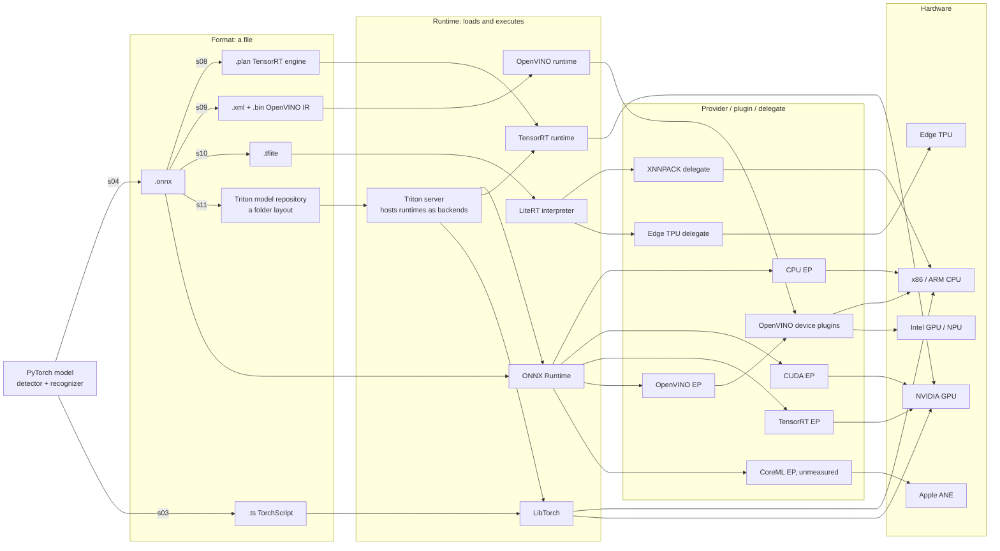

# 03 — Formats, runtimes, backends

From s03 onward, each stage turns the same two models into a different file: `.ts`, `.onnx`, `.plan`, `.xml` + `.bin`, `.tflite`, or a Triton model repository. None of these files has a speed. A format is a file, a runtime executes it, a provider or plugin inside the runtime picks the kernels, and the hardware runs them. This guide draws that stack once as a map for the stages that follow. The export mechanics of s04 are covered in [guide 05](05-onnx-and-execution-providers.md).

## 1. The problem it solves

The box on the pole decides which files can run. A Jetson-class box has an NVIDIA GPU, so it can use TensorRT. A Raspberry Pi-class box has only ARM cores, so the choice is LiteRT with XNNPACK or ONNX Runtime on CPU. An Intel roadside PC points to OpenVINO, and a site box serving many cameras points to a server such as Triton. "We exported to ONNX and it was slow" tells you nothing until it names the runtime, the provider and the hardware, and each of those can change without touching the file.

A format also holds only a graph, and only part of the ANPR pipeline is a graph. JPEG decode, letterbox, crop and CTC decode stay in Python unless a stage moves them. So choosing a format also decides what still runs outside it and still counts against 30 ms.

## 2. Mental model



- **Format:** a serialized graph plus weights. A Triton model repository is a folder layout, not a format: `config.pbtxt` plus numbered version directories holding files in the formats above.
- **Runtime:** loads a format and executes it. Triton is a server that hosts runtimes as *backends*: `platform: "onnxruntime_onnx"` for `detector`, `backend: "python"` for the `anpr` pipeline model.
- **Provider / plugin / delegate:** the runtime's hardware-specific kernels. ONNX Runtime, OpenVINO and LiteRT each use one of those three names.
- **Hardware:** the chip that does the work.

> **Why "ONNX is slow" means nothing.** ONNX is a file format, not a runtime. The same `detector_baseline.onnx` runs in s04 under `CPUExecutionProvider`, `CUDAExecutionProvider`, `TensorrtExecutionProvider` (which builds a TensorRT engine when the session is created) and `OpenVINOExecutionProvider`. A latency claim has to name the runtime, the provider and the hardware.

The `providers` argument is an ordered list. ORT gives each part of the graph to the first provider in the list that can run it, and moves on to the next provider when one can't or fails to load, without raising an error. That's why `src/backends.py :: OrtBackend` records what actually ran:

```python
        self.det = ort.InferenceSession(str(artifact(detector)), opts, providers=providers)
        self.rec = ort.InferenceSession(str(artifact(ocr)), opts, providers=providers)
        # ORT silently falls back to CPU when a provider fails to load. Record what ran.
        self.active_providers = self.det.get_providers()
```

**The part people get wrong: portability.** An ONNX file is portable, but its performance isn't, and some formats aren't portable at all.

| Format | Produced by | Runtime | Typical target | Portable across hardware? |
|---|---|---|---|---|
| `.onnx` | s04 (`snippet:onnx-export`), re-exported by later stages | ONNX Runtime + any provider; input to TensorRT, OpenVINO, onnx2tf, Triton | interchange | the file, yes; speed depends on provider and hardware |
| `.ts` | s03 (`snippet:jit-trace`) | LibTorch, Triton's PyTorch backend | existing LibTorch services | CPU and CUDA; a trace records one execution path |
| `.plan` | s08 (`snippet:trt-build`) | TensorRT runtime | NVIDIA GPU: Jetson, RTX 3090 | **no**: tied to the GPU model and TensorRT version |
| `.xml` + `.bin` | s09 (`snippet:ov-convert`, `snippet:nncf-quantize`) | OpenVINO runtime | Intel CPU, GPU, NPU; ARM CPU | yes; compiled for one device at load time |
| `.tflite` | s10 (`snippet:onnx2tf-convert`) | LiteRT interpreter | ARM CPU (Raspberry Pi); Edge TPU needs its own compiled model | across CPUs; delegates restrict ops and dtypes |
| `model_repository/` | s11 | Triton server | site box serving many cameras | the layout, yes; each file inside keeps its own limits |

**Where the pipeline's pieces live.**

| Piece | Eager PyTorch (s01) | Exported graph (any format) | Triton `anpr` model (s11) |
|---|---|---|---|
| JPEG decode | Pillow | Pillow (nvJPEG in s00 `gpu-decode`) | client sends a decoded frame |
| Letterbox | Pillow + numpy | Pillow + numpy | server, Python backend |
| Detector + box decode | PyTorch | in the graph (`DetectorExport`) | ONNX model in the repository |
| Top-K + NMS | numpy `greedy_nms` | numpy, or in the graph with `nms_in_graph` | in the graph (`detector_nms`) |
| Crop from the full-resolution frame | Pillow + numpy | Pillow + numpy | server, Python backend |
| Recognizer | PyTorch | in the graph | ONNX model in the repository |
| CTC decode | numpy | numpy | server, Python backend |

A server that reimplements pieces of the pipeline has to prove they match the client. The `anpr` model has its own numpy letterbox that averages 2x2 blocks, which matches s00's `fast-resize` path rather than the bilinear default. `triton_serving/client.py` compares server output with the local pipeline before s11 takes any measurements.

**The naming trap.** Two unrelated projects are called Triton: NVIDIA's inference server (s11) and the kernel language that `torch.compile` uses to generate GPU kernels. While this repo was being built, a top-level `triton/` folder sat in the working directory. `python -m` puts that directory first on the import path, so `torch._dynamo` imported the folder instead of the package, and `import torchvision` failed with `module 'triton' has no attribute 'language'`. That's why the folder is named `triton_serving/`, why `src/config.py` has a comment next to `TRITON_REPO`, and why `tests/test_repo_hygiene.py :: test_no_top_level_triton_folder` exists.

## 3. Runnable walkthrough

```bash
make doctor          # which providers, GPUs and runtimes this machine has
make s04             # export, check, gate, then every available ORT provider
make setup-gpu       # on the 3090: onnxruntime-gpu + TensorRT
```

In `src/stages/s04_onnx_export.py`, read `provider_rows` first. It returns `(RunSpec, reason)` pairs, and any provider missing from `ort.get_available_providers()` becomes a `not_run` row with that reason. `snippet:trt-execution-provider` shows a provider list with options: TensorRT with FP16 and an engine cache, then CUDA, then CPU. Each available row is gated against eager PyTorch (strictly for FP32) and then measured. Guide 05 walks through the export call itself.

Next, read the contract at the top of `src/backends.py`. Every runtime implements `detect`, `ocr` and `sync`, so `src/pipeline.py` never knows which runtime it is calling. The other formats come from `make s03` (`.ts`), `make s08` (`.plan`), `make s09` (IR), `make s10` (`.tflite`, in `.venv-edge`) and `make s11` (the Triton repository).

## 4. Measured result

<!-- results:stage:s04_onnx_export -->
_Hardware `3cc807d0` · profile `quick`_

**Measured on:** Apple M3 Pro · 18.0 GB RAM · GPU: none · Darwin 25.5.0 arm64 · Python 3.12.12
**Threads:** ANPR_THREADS=4, OMP_NUM_THREADS=4, ORT intra_op_num_threads=4, inter_op=1
**Latency batch size:** 1 · **SLA:** p95 <= 30.0 ms per frame · **Profile:** `quick` · **Validation set sha256:** `aceb33513379`
**Libraries (as loaded by the rows below):** torch 2.13.0, onnxruntime 1.30.0, openvino 2026.3.1, nncf 3.3.0, ai-edge-litert 2.2.0

| row | parent | runtime · device · precision | mAP@0.5 | OCR exact | p50 ms | p95 ms | ≤ SLA | fps (batch) | size MB | peak RSS MB | $/1M frames @ $1/h | status |
|---|---|---|---|---|---|---|---|---|---|---|---|---|
| `s01_baseline:eager-fp32` | (root) | torch · cpu · fp32 | 0.905 | 0.933 | 54.1 | 58.3 | no | 18.5 (b1) | 37.25 | 1316 | — | ok |
| `s04_onnx_export:ort-cpu-fp32` | `s01_baseline:eager-fp32` | ort · cpu · fp32 | 0.905 | 0.933 | 105.8 | 133.8 | no | 10.2 (b8) | 37.46 | 578 | — | ok |
| `s04_onnx_export:ort-cpu-fp32-nms-in-graph` | `s04_onnx_export:ort-cpu-fp32` | ort · cpu · fp32 · NMS in graph | 0.905 | 0.933 | 100.5 | 124.7 | no | 10.4 (b8) | 37.50 | 621 | — | ok |
| `s04_onnx_export:ort-cuda-fp32` | `s01_baseline:eager-fp32` | ort · cuda · fp32 | — | — | — | — | — | — | — | — | — | not_run: CUDAExecutionProvider not available (needs onnxruntime-gpu + NVIDIA GPU) |
| `s04_onnx_export:ort-openvino-ep-cpu` | `s01_baseline:eager-fp32` | ort · cpu · fp32 | — | — | — | — | — | — | — | — | — | not_run: OpenVINOExecutionProvider not available (install onnxruntime-openvino in its own venv; it  |
| `s04_onnx_export:ort-tensorrt-ep-fp16` | `s01_baseline:eager-fp32` | ort · cuda · fp16 | — | — | — | — | — | — | — | — | — | not_run: TensorrtExecutionProvider not available (onnxruntime-gpu + TensorRT 10 libs) |

<!-- /results -->

The runtime column reads `ort · device · precision` for every s04 row: the runtime is the same, and the provider is in the variant name. To see what actually ran, compare `options.providers` (what was requested) with `active_providers` (what the detector session registered) in `results/results.json`.

- **FP32 provider rows vs the eager parent:** accuracy should match, since the strict gate already required it. A latency difference is a result about runtime plus hardware: "ONNX Runtime's CPU provider on this CPU at batch 1", never "ONNX".
- **`ort-cpu-fp32-nms-in-graph` vs `ort-cpu-fp32`:** compare the totals, and check mAP for Fast NMS differences (guide 00).
- **`ort-tensorrt-ep-fp16`:** parity only reports here, so judge it by its accuracy columns. `size MB` counts the ONNX files, not the cached engines.
- **`not_run` rows** name what this machine lacks.

## 5. Gotchas

1. **Silent provider fallback.** **Symptom:** `ort-cuda-fp32` latency is close to `ort-cpu-fp32` even though its device column says `cuda`. **Fix:** check `active_providers`. The usual cause is having both `onnxruntime` and `onnxruntime-gpu` installed, which `make setup-gpu` resolves. Guide 05 covers the other causes.
2. **A registered provider doesn't mean the whole graph runs on it.** **Symptom:** `active_providers` lists `TensorrtExecutionProvider`, but the row behaves like the CUDA row. **Fix:** registration says nothing about where each node runs. Turn on verbose ORT session logging to see which nodes TensorRT took.
3. **Copying an engine to another GPU.** **Symptom:** `engine failed to deserialize — built with another TensorRT version or GPU?` on the Jetson, for a `.plan` built on the 3090. **Fix:** ship the ONNX and build the engine on the device. `.gitignore` excludes `*.plan` and `*.engine` for this reason, and the TensorRT provider's engine cache has the same limitation.
4. **A folder named `triton/`.** **Symptom:** `import torchvision` fails with `module 'triton' has no attribute 'language'`, but only when run from the repo directory. **Fix:** rename the folder; this repo uses `triton_serving/`.
5. **The OpenVINO provider breaking the main venv.** **Symptom:** after `onnxruntime-openvino` is installed into `.venv`, the CPU or CUDA provider rows change or fail. **Fix:** it replaces `onnxruntime`, so give it its own venv. Also don't confuse `ort-openvino-ep-cpu` (ORT driving an OpenVINO plugin) with s09 (the OpenVINO runtime running IR).
6. **The TensorRT provider's first session.** **Symptom:** creating the `ort-tensorrt-ep-fp16` session on a fresh machine takes far longer than for any other provider. **Fix:** that time is the engine build. Keep the engine cache on, and clear `trt_ep_cache` whenever TensorRT, the GPU or the ONNX file changes.
7. **A server-side reimplementation drifting.** **Symptom:** the s11 server-pipeline row's accuracy differs from the client-pipeline rows, even though both serve the same ONNX files. **Fix:** the `anpr` model has its own letterbox, crop and CTC code. Run the `triton_serving/client.py` comparison and fix the preprocessing, not the model.

## 6. AV comparison callout

> **Context only — not part of the lab.** A YOLO-class vehicle and pedestrian detector or a lane segmentation network in a vehicle usually ships as a TensorRT engine, built on the vehicle's exact hardware and software image. The engine is a build artifact specific to one platform, and the ONNX or checkpoint stays the source of truth. That's the same discipline as here, forced by the same portability limit. What lives inside the format is different. Camera preprocessing typically runs on the accelerator from raw sensor data, and lane segmentation has no variable-count second stage, so almost the whole path fits in one graph. In our pipeline, the per-plate OCR calls are why crop and CTC decode stay outside the formats unless a server hosts them.

## 7. When NOT to use this

- **Don't export to a format the target doesn't need.** Each one adds a converter with its own version pins (s10 needs its own venv), another parity gate and new ways to fail.
- **Don't pick the format first.** Pick the box, then the best runtime for it; the format follows from that.
- **Don't start new work in TorchScript.** It's deprecated. Use it only when a consumer, such as a LibTorch service or Triton's PyTorch backend, requires `.ts`.
- **Don't put Triton on a single-camera box.** A server process and a network hop add serialization with nothing to batch.
- **Don't treat the TensorRT provider and native TensorRT as interchangeable.** Compare the s04 provider row with the s08 engine rows on the same hardware.

Previous: [02 — Benchmarking properly](02-benchmarking-properly.md) · Next: [04 — torch.compile and TorchScript](04-torch-compile-and-torchscript.md)
