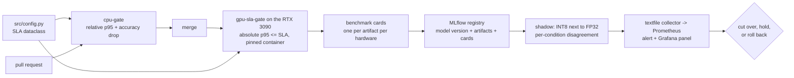

# 15 — Optimization in your MLOps stack

A faster model that nobody can reproduce, verify or roll back is a demo. Guides 00
to 13 produced faster artifacts. This guide makes those gains *stay*. A CI gate
fails the build when a PR brings the slowness back. A benchmark card travels with
each artifact into the Session 2 registry. A pinned container builds engines the
serving GPU can load. A shadow comparison and the Session 4 monitoring stack catch
the INT8 model getting worse at night, before a customer does. This is what makes
Session 5 an Ops session and not a kernels session.

---

## 1. The problem it solves

Optimization gains decay in three distinct ways, at three distinct times:

| Failure | When it happens | What catches it | Plugs into |
|---|---|---|---|
| a PR puts Python NMS back in the hot path, or swaps the runtime, and p95 creeps up | **merge time** | the CI perf gate: `ci/perf_gate.py` + `.github/workflows/session5-perf-gate.yml` | Session 2's CI |
| someone deploys `model_int8.tflite` on the strength of the FP32 model's numbers, or ships a TensorRT engine built for another GPU | **release time** | benchmark cards per artifact + pinned build container | Session 2's MLflow registry; Session 3's Triton |
| after cutover, the traffic mix shifts (more night, more rain) and the INT8 model's per-condition weakness starts to dominate | **run time** | shadow disagreement per condition + drift on input statistics | Session 3's shadow release; Session 4's Prometheus, Grafana, Evidently |

A unit test answers "does it run?". Nothing in Sessions 1–4 answers "is it still
fast enough, still accurate enough, and still the artifact we measured?". That is
the gap this guide closes.

---

## 2. Mental model

Every journey-table row carries five metrics plus a cost. In this guide those
numbers become **contracts**, checked at three points, all read from one file:



> **Why every threshold lives in `src/config.py`.** The `SLA` dataclass holds the
> latency budget (`p95_ms`), the batch size and the allowed accuracy drops
> (`max_map50_drop`, `max_ocr_em_drop`). `ci/perf_gate.py` reads `config.SLA_TARGET`
> and never keeps its own copy. `tools/journey_table.py` and
> `tools/benchmark_card.py` read the same object for the `≤ SLA` column and the SLA
> verdict. Copy the numbers into a workflow YAML and the day someone tightens the
> SLA, the table says one thing and CI enforces another. Both will look
> authoritative.

> **Why relative *and* absolute checks.** A GitHub-hosted runner has no GPU and
> shares its CPU with other workloads, so its absolute p95 means nothing about the
> roadside box. A *ratio* between two rows measured on the same runner in the same
> job does mean something: "this PR made the ONNX Runtime row slower than it was
> against the same reference". The absolute question, "p95 ≤ SLA", only has an
> answer on the target hardware. So it runs only there, behind `--enforce-sla`.

---

## 3. Runnable walkthrough

### 3a. The CI perf gate

The check itself is short: `snippet:perf-gate` in `ci/perf_gate.py`. It runs three
checks and prints every failure with both numbers:

| Check | Rule | Threshold comes from | Runs where |
|---|---|---|---|
| accuracy | baseline (`--baseline`, default `s01_baseline:eager-fp32`) mAP@0.5 minus candidate mAP@0.5, and the same for exact match, may not exceed the allowed drop | `SLA.max_map50_drop`, `SLA.max_ocr_em_drop` | everywhere |
| regression | with `--remeasure`, the candidate is measured again now; its new p95 may not exceed its **own recorded** p95 × `--max-p95-ratio` | the CLI flag (its default is in `ci/perf_gate.py`) | everywhere |
| absolute | candidate p95 ≤ `SLA.p95_ms` (30 ms) | `SLA.p95_ms` | only with `--enforce-sla`, on the target hardware |

It looks rows up by `(row id, hardware_id, profile)`. `hardware_id`
(`src/environment.py`) hashes the CPU, the GPU **and** `ANPR_THREADS`, so the gate
can only compare rows measured on the same machine at the same thread count.
That restriction is intentional.

> **Why latency is compared with the row's own record, not with another row.** An
> early version gated the ONNX Runtime row against the eager PyTorch baseline. On the
> laptop that produced the committed results, the ONNX Runtime row is the *slower*
> one (compare the two s04/s01 rows in the journey table), so that gate failed for a
> hardware reason and would pass on a machine where the order flips. A code change
> that slows ONNX Runtime down, on the other hand, slows it down on every machine —
> which is exactly what re-measuring a row against its own record detects.

**Where the workflow lives.** It is `.github/workflows/session5-perf-gate.yml` at
the *repository root*
([view](../../.github/workflows/session5-perf-gate.yml)), not under `session_5/ci/`,
because GitHub only runs workflows from the root `.github/workflows/` directory.
Session 2's CI workflow sits in the same place for the same reason. The gate
*logic* stays in `session_5/ci/perf_gate.py`, so it runs identically from `make`
and from Actions.

| Job | Runner | Profile | What it does |
|---|---|---|---|
| `cpu-gate` | `ubuntu-latest`, GitHub-hosted | `ci`: tiny data, a few epochs | installs CPU wheels, generates data, trains, runs s01 and s04, then gates `s04_onnx_export:ort-cpu-fp32`: accuracy against `s01_baseline:eager-fp32`, and a re-measured p95 against its own record. Uploads `results/` as a build artifact |
| `gpu-sla-gate` | `[self-hosted, linux, gpu]`, the RTX 3090 box | `quick` | builds `ci/docker/Dockerfile.gpu`, runs `make profile s04 s07 s08` inside it, then gates `s08_tensorrt:student-fp16` with `--enforce-sla`. Enabled only when the repo variable `SESSION5_GPU_RUNNER` is `true` |

Triggers: pull requests touching `session_5/src/**`, `session_5/ci/**`,
`session_5/tools/**`, `session_5/Makefile`, `session_5/requirements*.txt` or the
workflow file, plus `workflow_dispatch` with an `inject_latency_ms` input.

Run it locally, from `session_5/`, after the rows exist (`make s01 s04`):

```bash
make gate          # accuracy vs the eager baseline + re-measured p95 vs the ONNX row's own record
make gate-demo     # the same with an injected detector delay: watch it fail

# on the target GPU, the absolute check as well
python -m ci.perf_gate --candidate s08_tensorrt:student-fp16 --remeasure --enforce-sla
```

**How to see it fail.** `make gate-demo` sets `ANPR_INJECT_LATENCY_MS`. With that
variable set, `src/benchmark.py` wraps the backend's `detect` call in a sleep, so
every frame pays a deliberate regression. `--remeasure` re-runs the candidate
through the harness with `run(spec, record=False)`. The slow measurement is
compared and printed, and it **never overwrites** the stage's real row in
`results/results.json`. In Actions: *Actions → session5-perf-gate → Run workflow*,
set `inject_latency_ms`. That step compares the re-measured ONNX row against its
own clean measurement, so the only difference between the two is the injected
delay. The captured output of a failing run is in
[`ci/README.md`](../ci/README.md#demo-the-gate-failing).

> **Why a regression you inject yourself.** A gate you have never seen fail is a
> gate you do not know works. A mistyped row id, a threshold read as zero, or a step
> whose exit code is swallowed all look exactly like a passing build.

### 3b. Benchmark cards in the model registry

A model version in the registry is not one file. The same trained weights become
several deployable artifacts, and each one has its own accuracy, latency and memory
**on its own hardware**:

| Artifact | Built by | Runs on | Its card |
|---|---|---|---|
| `detector_student.onnx` + `ocr_student.onnx` | s07 | ONNX Runtime on any CPU; Triton (s11) | `s07_distillation__student-distilled-onnx.md` |
| TensorRT engines FP16 / INT8 | s08, inside the pinned container | the GPU model *and* TensorRT version they were built with | `s08_tensorrt__student-fp16.md`, … |
| OpenVINO IR (`.xml` + `.bin`), NNCF INT8 | s09 | x86 CPU, Intel GPU | `s09_openvino__student-int8-nncf.md`, … |
| `.tflite` full-integer INT8 | s10 | ARM CPU via XNNPACK; phone delegates | `s10_tflite_edge__tflite-int8-full.md`, … |

`tools/benchmark_card.py` renders `ci/benchmark_card.md.tmpl` once per measured row
into `results/cards/<hardware_id>_<profile>/<stage>__<variant>.md`. `make table`
runs it together with the journey table. A card records:

- lineage: the parent row it was built from
- runtime · device · precision, and the SLA verdict
- profile and validation-set sha256; git commit and timestamp
- accuracy per condition, and latency per phase
- the throughput curve, artifact size, peak RSS and peak VRAM
- the parity report against its parent, and the full environment

> **Why one card per artifact per hardware, and not one per model version.** The
> INT8 TFLite file and the FP16 TensorRT engine come from the same training run and
> can differ in exactly the ways that matter. Night exact match is one example; peak
> memory on a Raspberry Pi is another. A registry entry that holds one set of
> metrics for "the model" invites someone to deploy the INT8 file on the FP32
> file's numbers. The template's own line applies: a number without this card is a
> rumour.

**Logging them with MLflow.**
[Session 2](../../session_2/README.md#1-mlflow--experiment-tracking--model-registry)
registered one model version per training run and annotated it with tags
([Step 6](../../session_2/README.md#step-6--register-only-the-winner)). Keep that. Then
attach the per-target artifacts as nested runs, one per artifact × hardware, each
holding the artifact, its card and the tags you will search on:

```python
import mlflow
from mlflow import MlflowClient

from src import config, results

MODEL, VERSION = "anpr-plate-reader", "7"          # the version Session 2's Step 6 registered
# The files each deployable row ships. Your paths; an OpenVINO IR is .xml + .bin, log both.
DEPLOYABLE = {
    "s07_distillation:student-distilled-onnx": ["detector_student.onnx", "ocr_student.onnx"],
    "s09_openvino:student-int8-nncf": ["detector_student_int8.xml", "detector_student_int8.bin",
                                       "ocr_student_int8.xml", "ocr_student_int8.bin"],
}

client = MlflowClient()
with mlflow.start_run(run_name=f"{MODEL}-v{VERSION}-deployables"):
    for row in results.load():
        if row["status"] != "ok" or row["id"] not in DEPLOYABLE:
            continue
        card = (config.RESULTS_DIR / "cards" / f"{row['hardware_id']}_{row['profile']}"
                / f"{row['stage']}__{row['variant']}.md")
        with mlflow.start_run(run_name=f"{row['id']}@{row['hardware_id']}", nested=True) as child:
            mlflow.set_tags({"hardware_id": row["hardware_id"], "backend": row["backend"],
                             "precision": row["precision"], "device": row["device"],
                             "profile": row["profile"], "built_from": row["parent"] or "(root)",
                             "git_sha": row["git_sha"], "model_version": VERSION})
            metrics = {"p95_ms": row["latency"]["total_ms"]["p95"], "map50": row["accuracy"]["map50"],
                       "ocr_exact_match": row["accuracy"]["ocr_exact_match"],
                       "peak_rss_mb": row["peak_memory_mb"]["rss"]}
            mlflow.log_metrics({k: v for k, v in metrics.items() if v is not None})
            for name in DEPLOYABLE[row["id"]]:
                mlflow.log_artifact(str(config.artifacts_dir() / name), artifact_path="artifact")
            mlflow.log_artifact(str(card), artifact_path="card")
        # the registry version points at each deployable run: from "v7" you can reach every artifact + card
        client.set_model_version_tag(MODEL, VERSION, f"deployable.{row['stage']}.{row['variant']}.{row['hardware_id']}",
                                     child.info.run_id)
```

At deploy time, the question is "which artifact of version 7 was measured on *this*
box, at *this* precision". That is a search over tags, not a filename convention:

```python
mlflow.search_runs(search_all_experiments=True,
                   filter_string="tags.model_version = '7' and tags.hardware_id = '<target id>' and tags.precision = 'int8'")
```

Session 2 used one alias, `@champion`. With several targets, give each target its
own alias (`client.set_registered_model_alias(MODEL, "edge_x86", VERSION)`), and
move it only when *that target's* card passes. A version can be ready for the GPU
server and not yet for the Raspberry Pi.

### 3c. Pinned build containers

A TensorRT engine is not a portable file. It is a plan compiled for **one GPU model
and one TensorRT version**. Build it with a different TensorRT than the serving
Triton loads and deserialization fails. Build it on a different GPU and it will
not run, or will run with kernels tuned for the wrong card. TensorRT has opt-in
hardware- and version-compatibility build modes that trade some performance for
portability; this session does not use them. The rule the course follows is
simpler: **build where you serve, inside a pinned container**.

`ci/docker/Dockerfile.gpu` pins every layer of that matrix:

| Layer | Pinned to | What breaks if it drifts |
|---|---|---|
| base image | `nvcr.io/nvidia/tensorrt:26.05-py3` | the TensorRT inside it changes with every NGC release |
| TensorRT | 10.16.1.11, the same as `nvcr.io/nvidia/tritonserver:26.05-py3` | an engine built here must deserialize in s11's Triton |
| CUDA | 13.2.1 (from the image) | `onnxruntime-gpu` and torch wheels must match its major version |
| Python wheels | `torch==2.13.0+cu130`, `onnxruntime-gpu==1.30.0`, `nvidia-ml-py` | the same pins as `requirements-gpu.txt` |
| host driver | R580 or newer | CUDA 13.x minor-version compatibility needs it |
| GPU | the RTX 3090 (Ampere, SM 8.6) the self-hosted runner sits on | engines are per GPU model |

Why 26.05 in particular: NGC 26.05 is the last release with TensorRT 10.x in both the TensorRT and Triton containers (https://docs.nvidia.com/deeplearning/triton-inference-server/release-notes/rel-26-05.html).
TensorRT 11 removed implicit INT8 calibration (https://docs.nvidia.com/deeplearning/tensorrt/latest/getting-started/release-notes-11/11.0.0.html),
and s08 teaches implicit calibration through `snippet:int8-calibrator`. An
unpinned `:latest` tag would eventually remove the INT8 rows from the journey table
for reasons that have nothing to do with the model.

```bash
docker build -f ci/docker/Dockerfile.gpu -t anpr-gpu:26.05 .
docker run --rm --gpus all -v "$PWD":/workspace/session_5 anpr-gpu:26.05 make all
```

> **Why `--system-site-packages` in the Dockerfile's venv.** The NGC image already
> ships TensorRT's Python bindings. The venv can see them, so pip never installs the
> `tensorrt-cu13` wheel over them. Two TensorRTs on one path is the version
> mismatch above, packed into a single container.

The `gpu-sla-gate` job is this rule applied in CI. It builds the image *on* the
3090 runner, builds the engines inside it, and enforces the SLA on the same box.

### 3d. Shadow-deploying INT8 against FP32 before cutover

[Session 3](../../session_3/README.md#shadow-mode--zero-risk-eval) introduced shadow
mode as a release strategy: the new model sees a copy of every request, and only the
old one answers. `ci/shadow_compare.py` applies it to a precision change
(`snippet:shadow-compare`). The FP32 and INT8 pipelines see identical frames. For
every plate FP32 reads, the INT8 pipeline counts as disagreeing if it finds no box
with IoU above 0.5, or reads different text. The ratio is kept **per condition**,
because INT8 damage is rarely uniform.

```bash
# quantization only: the same baseline weights, FP32 vs s06a's stratified static INT8, both on ONNX Runtime
python -m ci.shadow_compare --fp32 detector_baseline.onnx,ocr_baseline.onnx \
    --candidate detector_int8_stratified.onnx,ocr_int8_stratified.onnx --candidate-backend ort

# the edge candidate: the distilled student FP32 on ONNX Runtime vs its NNCF INT8 IR on OpenVINO
python -m ci.shadow_compare --fp32 detector_student.onnx,ocr_student.onnx \
    --candidate detector_student_int8.xml,ocr_student_int8.xml --candidate-backend openvino
```

Always pass both pairs explicitly, and make them share a parent. The script's
defaults put the student FP32 files next to INT8 files quantized from the
*baseline*, which would measure distillation and quantization at once. The script
does three things:

- writes `results/shadow/shadow_<profile>.prom` in Prometheus text format, one
  `anpr_shadow_plate_disagreement_ratio{condition=…,candidate=…}` gauge per
  condition
- prints the same lines
- exits non-zero when the worst condition exceeds `--max-disagreement`, so the same
  script can be a release gate

> **Why disagreement needs no labels.** Accuracy needs ground truth, and in the field
> plate labels arrive late or never. Disagreement between two models on the same
> frame is available immediately. It is the same move as Session 4's prediction
> drift: a proxy you watch while waiting for the truth. A high disagreement ratio
> doesn't tell you which model is wrong, only that promoting the candidate changes
> the answers users get.

**Where shadow runs when the camera has no uplink.** The roadside box cannot run
FP32 and INT8 side by side. That would double the work inside a 30 ms budget.
Shadow the candidate where there is spare compute: on frames recorded on the box
and replayed on a bench or a central server, or on cameras that do have backhaul.
The code is the same; only the source of the frames changes.

### 3e. Monitoring quantization-induced drift with the Session 4 stack

**Get the gauge into Prometheus.** Session 4's node-exporter
(`session_4/docker-compose.yaml`) does not enable the textfile collector. Add a flag
and a read-only mount pointing at the directory the shadow job writes to:

```yaml
  node-exporter:
    volumes:
      - ../session_5/results/shadow:/textfile:ro
    command:
      - --collector.textfile.directory=/textfile
```

In production, write the file under a temporary name and rename it into place. The
collector reads whatever is in the directory at scrape time, including a
half-written file.

**Alert on it.** A sketch in the style of `session_4/monitoring/prometheus/alert_rules.yml`:

```yaml
  - name: anpr-precision
    rules:
      - alert: ShadowInt8DisagreementHigh
        expr: max by (condition, candidate) (anpr_shadow_plate_disagreement_ratio) > 0.05   # match --max-disagreement
        for: 1h
        labels: {severity: warning}
        annotations:
          summary: "INT8 candidate reads {{ $labels.condition }} plates differently from FP32"
      - alert: ShadowCompareStale        # a gauge nobody refreshes looks exactly like a healthy one
        expr: time() - node_textfile_mtime_seconds{file=~".*shadow_.*\\.prom"} > 86400
        for: 1h
        labels: {severity: warning}
```

**Catch "night traffic grew and INT8 is worse at night".** Each signal alone misses
this failure. The per-condition disagreement ratios can stay flat while the fleet
gets worse, because the *mix* moved toward the condition the INT8 model handles
worst. Two pieces are needed:

1. **Evidently on per-frame input statistics.** In the field, nobody labels a frame
   "night". Log cheap proxies per frame instead: mean luminance, contrast, a blur
   score (variance of the Laplacian), detected plate height, hour of day. Compare
   them with Evidently, using the legacy API that
   [Session 4 Guide C](../../session_4/README.md#guide-c--evidently) pins
   (`evidently<0.7`). The reference should be **the calibration set's frames**:
   that is the distribution the INT8 scales were fit on, so drift away from it is
   drift away from what INT8 was calibrated for.

   ```python
   from evidently.report import Report
   from evidently.metric_preset import DataDriftPreset

   report = Report(metrics=[DataDriftPreset()])
   report.run(reference_data=calibration_frame_stats, current_data=last_24h_frame_stats)
   report.save_html("reports/int8_input_drift.html")
   ```

   Publish the per-condition *share* of recent traffic as a gauge (for example
   `anpr_condition_share{condition=…}`), through the same path Session 4 uses for
   its PSI gauges.

2. **Combine share and damage in PromQL.** Expected disagreement for the traffic you
   actually have:

   ```promql
   sum(anpr_condition_share * on (condition) group_left() max by (condition) (anpr_shadow_plate_disagreement_ratio))
   ```

   The per-condition gauges only move when the model changes. This one also moves
   when the world changes.

**The Grafana panels**, built the way
[Session 4 Guide B](../../session_4/README.md#guide-b--grafana) builds rows:

| Panel | Query | Viz |
|---|---|---|
| Disagreement by condition | `max by (condition) (anpr_shadow_plate_disagreement_ratio)` | Time series, threshold line at the gate value |
| Worst condition now | `topk(1, max by (condition) (anpr_shadow_plate_disagreement_ratio))` | Stat |
| Traffic mix | `anpr_condition_share` | Time series, stacked |
| Expected disagreement for current traffic | the combined query above | Time series, same threshold |
| Shadow data age | `time() - node_textfile_mtime_seconds{file=~".*shadow_.*"}` | Stat, unit seconds |

When the alert fires, work through
[Session 4's RUNBOOK](../../session_4/RUNBOOK.md) as you would for any alert. Step 3,
"what changed", is either a new candidate artifact (read its card) or a new traffic
mix (read the Evidently report).

---

## 4. Measured result

<!-- results:journey -->
<!-- /results -->

How to read this for the purposes of this guide:

- **Read the hardware header before any row.** Each table is one `(hardware_id,
  profile)` pair, and its header names the CPU, GPU, driver, thread settings and
  library versions. A p95 from one table cannot be compared with a p95 from another.
  The perf gate enforces this by looking rows up by `hardware_id`.
- **The CI gate's two rows are in here.** `s04_onnx_export:ort-cpu-fp32` is the
  candidate and `s01_baseline:eager-fp32` is the reference. Their p95 ratio and
  their accuracy difference are exactly what `make gate` checks. On the GPU table,
  `s08_tensorrt:student-fp16` is the row `gpu-sla-gate` holds to the absolute SLA.
- **Read the `≤ SLA` column only on target hardware.** On a laptop CPU it tells you
  about the laptop.
- **Open the lineage details.** The stages are a tree. The shadow pair you promote
  must share a parent there, or the disagreement ratio mixes two changes.
- **`not_run` rows carry their reason.** A TensorRT row that is `not_run` on the
  M3 Pro says "no CUDA + TensorRT 10 here". It says nothing about TensorRT. The
  same row on the RTX 3090 table is the one that counts.

---

## 5. Gotchas

1. **Thresholds copied into the workflow file.**
   **Symptom:** the SLA was tightened in `src/config.py`, the journey table's `≤ SLA`
   column changed, and CI still passes PRs against the old number.
   Every threshold is read from `config.SLA_TARGET`. The only number the workflow
   passes is the row ids. Keep it that way.

2. **An absolute SLA check on a GitHub-hosted runner.**
   **Symptom:** red builds on PRs that touched documentation, and green builds on
   PRs that doubled the detector's work, depending on what else the shared runner
   was doing.
   `cpu-gate` runs without `--enforce-sla` for this reason. The absolute check
   belongs to `gpu-sla-gate` on the self-hosted RTX 3090.

3. **Changing `ANPR_THREADS` and expecting the gate to find the rows.**
   **Symptom:** `gate: no measured row 's01_baseline:eager-fp32' for this hardware
   (…) and profile — run its stage first`, on a machine where you just ran it.
   `hardware_id` hashes the thread count together with the CPU and GPU. A row
   measured at another thread count belongs to a different machine as far as the
   gate is concerned. Re-run the stages with the same environment the gate runs with.

4. **Re-measuring with `record=True` in a home-made gate.**
   **Symptom:** after a regression demo, `make table` shows the slow numbers as the
   stage's real row, and every later gate compares against the regression.
   `ci/perf_gate.py` re-measures with `run(spec, record=False)`. Any variant you
   write must do the same.

5. **The workflow's path filter does not cover every file that changes performance.**
   **Symptom:** a PR that edits `requirements-gpu.txt`, the `Makefile` or `tools/`
   merges without the gate running at all.
   The trigger lists `session_5/src/**`, `session_5/ci/**`,
   `session_5/requirements.txt` and the workflow file. Extend it if your changes to
   other files can move latency.

6. **An engine built outside the pinned container.**
   **Symptom:** Triton's log reports the TensorRT model failed to load, with an
   engine deserialization or version error, while the same engine ran fine in the
   notebook that built it.
   The notebook's TensorRT is not the server's. Build inside the container whose
   TensorRT matches the serving Triton, on the serving GPU.

7. **The CI profile's accuracy gate read as a model-quality gate.**
   **Symptom:** accuracy passes in `cpu-gate`, and the `quick` or `full` profile
   later shows an INT8 row dropping past the allowed limit.
   `ANPR_PROFILE=ci` trains on tiny data for a few epochs. The workflow comment says
   so: that gate checks the machinery, not model quality. Quality is judged on the
   profile whose card you ship.

8. **A shadow pair that does not share a parent.**
   **Symptom:** high disagreement on every condition, including clear daytime, for
   an INT8 model whose own journey row shows a small accuracy drop.
   You are comparing two architectures, not two precisions. Pass `--fp32` and
   `--candidate` explicitly from the same lineage (section 3d).

9. **Averaging disagreement across conditions.**
   **Symptom:** a flat global disagreement line on the dashboard while night
   disagreement climbs.
   The global number is weighted by volume, so a condition with a small share cannot
   move it: Session 4's incident 05 with lighting in place of city. Keep the
   `condition` label all the way to the panel and the alert.

10. **A card logged without its hardware tag.**
    **Symptom:** a search for the version's INT8 artifact returns three runs, and
    nobody can say which box they were measured on.
    Tag `hardware_id`, `backend`, `precision` on every nested run, and keep the card
    next to the artifact in the same run.

---

## 6. AV comparison callout

> **Context.** Automotive teams build the same three checkpoints at larger scale.
> Every perception model is evaluated per scenario slice (night, rain, glare,
> tunnels) rather than on one aggregate score, for the reason section 3e keys on
> `condition`. The compiler toolchain for each in-vehicle SoC is pinned per vehicle
> program, because an engine is compiled for that chip and that toolchain version.
> New models commonly run in shadow on the fleet, with their outputs logged and
> compared, before they control anything. The ANPR fleet is a smaller version of
> the same shape: many identical edge boxes, no uplink during operation, and a
> release process that has to prove an artifact on the hardware it ships to.

---

## 7. When NOT to use this

- **An absolute latency gate on shared CI.** Use the relative check there, or
  nothing. A gate that fails at random trains people to re-run until green, and that
  is worse than no gate.
- **Benchmark cards for artifacts nobody deploys.** Card the formats that reach a
  target. The rest of the journey table is a lab notebook. It belongs in
  `results.json`, not in the registry.
- **Shadowing on the constrained box itself.** If the target has no headroom for a
  second model, shadow on replayed frames elsewhere (section 3d). A shadow that
  pushes production past its budget has become the incident.
- **Per-condition drift monitoring when you have no condition proxy.** If nothing in
  the frame statistics separates the slices INT8 handles differently, the combined
  query is noise with a label on it. First find out *where* INT8 is weak
  (`make int8-debug`), then decide what to log.
- **A pinned GPU container for a CPU-only fleet.** The Dockerfile pins the
  TensorRT/CUDA/driver matrix. A fleet running OpenVINO or LiteRT still needs pinned
  versions, but in its own image, built for its own target.

---

Previous: [14 — LLM serving: the same four levers](14-llm-serving-same-levers.md) · Next: [16 — Decision guide](16-decision-guide.md)
