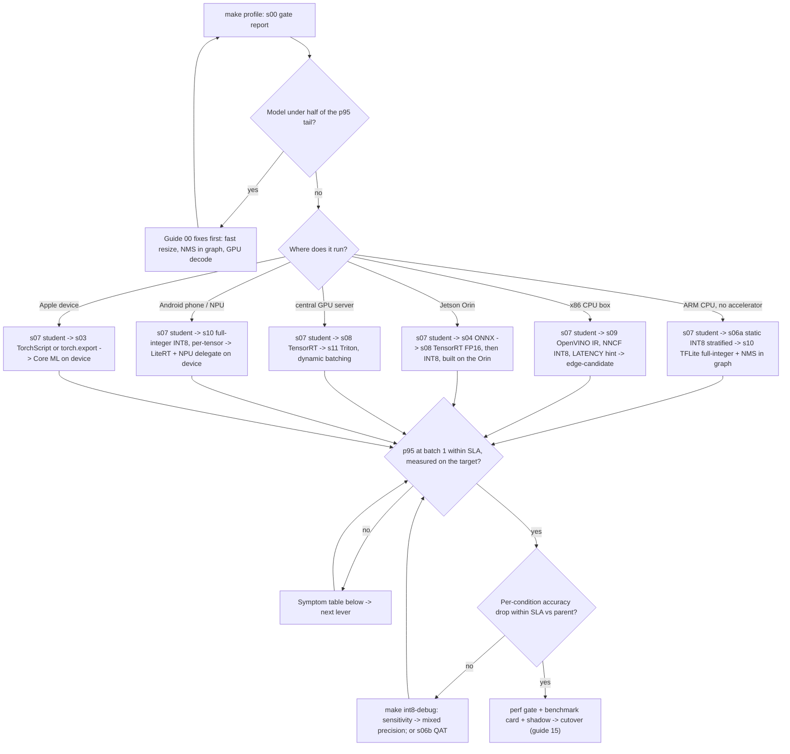

# 16 — Decision guide: which path do I take?

Thirteen stages produced a table, not a recommendation. This guide turns the table
into a recommendation for **your** deployment target. Choose the target first,
because the right sequence of stages for a Raspberry Pi is not the right sequence
for a Jetson or for a GPU server. For each target it gives the stages to run in
order, the rows to read to decide, the SLA check that settles it, and what a
`not_run` row means for that target. At the end: a table from symptoms in the
journey table to the next lever, the fleet cost arithmetic, and the case for not
optimizing at all.

---

## Three rules before any path

1. **Profile first, on every target.** `make profile` runs s00 and its gate
   (`snippet:profile-gate`). If the model is under half of the p95 tail, the next
   fix is in preprocessing and postprocessing (guide 00: fast resize, NMS in the
   graph, GPU decode), and no runtime or precision lever will help yet.
2. **The SLA is decided on the target, at batch 1.** `SLA.p95_ms` (30 ms) and
   `SLA.batch_size` (one frame at a time) in `src/config.py` describe a camera. A
   row measured anywhere else is evidence about *direction*, never a verdict.
3. **`not_run` is missing evidence, not bad evidence.** Every `not_run` row carries
   its reason: no CUDA, no Intel GPU, not measured on the device. It means "this
   machine could not answer". A path that depends on a `not_run` row is undecided
   until someone runs that stage on the hardware that can.

> **Why the target comes before the lever.** Levers do not compose the same way
> everywhere. INT8 on a CPU without VNNI-class instructions, dynamic batching on a
> compute-saturated CPU, FP8 on an Ampere GPU: each is a great lever somewhere and a
> non-event or a failure somewhere else. Session 3 found the same thing about
> `channels_last`: a flag that helps on one device and hurts on another is the
> normal case.

---

## The measured journey

<!-- results:journey -->
<!-- /results -->

Read it in this order:

1. **Header.** Which CPU, GPU, thread count, profile and library versions. If none
   of the tables were measured on your target, every path below starts with "run
   the stages there".
2. **The `≤ SLA` and `p95 ms` columns** for the rows your path names, on the table
   closest to your target.
3. **Accuracy against the row's parent,** not against the baseline. The allowed drop
   in `src/config.py` is per stage.
4. **Per-condition accuracy** on the row's benchmark card
   (`results/cards/<hardware>_<profile>/<stage>__<variant>.md`). Aggregate mAP hides
   a night-only collapse.
5. **The lineage details.** A TensorRT engine built from the distilled student does
   not contain the pruning rows printed above it.

---

## Decision flowchart



---

## Path by deployment target

### 1. Raspberry Pi 5, or any ARM CPU without an accelerator

The hardest budget in the session: a few ARM cores, shared memory bandwidth, a
thermal envelope. `ANPR_THREADS` defaults to 4 in `src/config.py` because that
matches the core count of the edge boxes this session targets.

| | |
|---|---|
| **Sequence** | s00 profile and its fixes → s07 distillation (reduce the work per frame first) → s06a static INT8 with the stratified calibration set → s10 TFLite full-integer INT8 with NMS in the graph and fast resize |
| **Rows to read** | `s00_profile:fast-resize`, `s00_profile:nms-in-graph` · `s07_distillation:student-distilled` against `s05_pruning:sliced-student-budget` · `s06a_ptq:ort-static-int8-stratified` against `…-daytime` · `s10_tflite_edge:tflite-int8-full`, `tflite-int8-full-nms` · `s10_tflite_edge:raspberry-pi-5` |
| **SLA check** | only `s10_tflite_edge:raspberry-pi-5`, measured on the Pi. The M3 Pro is ARM too, but it is a different core, memory system and thermal design. Its rows rank the candidates; they do not pass the SLA for the Pi |
| **`not_run` means** | `raspberry-pi-5` is `not_run` until someone runs s10 on the device. Until then the path is a ranked shortlist, not a decision. `tflite-fp16` records why the float16 file does not load in LiteRT's CPU kernels, which rules out FP16 as a Pi lever in this pipeline |

> **Why distill before quantizing here.** A distilled student cuts compute by
> architecture; INT8 cuts it by precision. On a CPU with no headroom you usually
> need both. Distilling first also means calibration and per-condition checks run
> once, on the model you ship, not on a baseline you then throw away.

### 2. x86 roadside box, CPU only (Intel or AMD)

| | |
|---|---|
| **Sequence** | s00 → s04 ONNX Runtime CPU → s07 → s09 OpenVINO: IR, NNCF INT8, `PERFORMANCE_HINT=LATENCY` → `edge-candidate` (INT8 student + NMS in graph + fast resize) |
| **Rows to read** | `s04_onnx_export:ort-cpu-fp32`, `ort-openvino-ep-cpu` · `s06a_ptq:ort-static-int8-stratified` · `s09_openvino:student-fp32-latency` against `student-fp32-throughput` · `s09_openvino:student-int8-nncf`, `edge-candidate` · `s09_openvino:intel-gpu` |
| **SLA check** | `edge-candidate` at batch 1 on the box's own CPU model. Whether INT8 beats FP32 depends on whether the CPU has VNNI-class integer instructions, which is exactly why this row has to come from that CPU |
| **`not_run` means** | `intel-gpu` is `not_run` when no Intel GPU is present. If your box has an Intel iGPU, that row is the one to run next, not a detail to skip. On AMD CPUs, measure `s06a_ptq:ort-static-int8-stratified` next to the OpenVINO rows on the box, rather than assuming either runtime wins |

> **Why the LATENCY hint and not THROUGHPUT.** A camera delivers one frame at a
> time. The THROUGHPUT hint plus an `AsyncInferQueue` (`snippet:ov-async-queue`)
> buys frames per second across a batch, which is capacity one camera cannot use,
> and it can cost p95 at batch 1. Read the two `student-fp32-*` rows to see what the
> hint changes on your CPU.

### 3. Jetson Orin

JetPack 7.2 ships TensorRT 10.16.2 and CUDA 13.2.1 (https://developer.nvidia.com/embedded/jetpack/downloads/archive-7.2).

| | |
|---|---|
| **Sequence** | s00 (check `s00_profile:gpu-decode`: preprocessing placement matters on a GPU) → s07 → s04 ONNX export → s08 TensorRT FP16 → s08 INT8 with the stratified calibrator (`snippet:int8-calibrator`), all **built on the Orin** |
| **Rows to read** | on the RTX 3090 table: `s08_tensorrt:student-fp32` (parity), `student-fp16`, `student-int8-entropy` against `student-int8-daytime`, and `s04_onnx_export:ort-tensorrt-ep-fp16`. These show the *method* and the accuracy behaviour of each precision. They are not Orin latencies |
| **SLA check** | the same `s08_tensorrt:*` rows re-measured on the Orin, in a table whose header names the Orin |
| **`not_run` means** | on a CPU machine, every s08 row is `not_run` ("no CUDA + TensorRT 10"). That says nothing about TensorRT on the Orin. Engines from the course's x86 container will not load there: different GPU, different architecture, different TensorRT patch. Treat the 3090 rows as a rehearsal and build again on the device |

> **Why INT8 calibration still works here.** JetPack 7.2 is still on TensorRT 10.x,
> so s08's implicit calibrator is available. On a TensorRT 11 stack, INT8 means a
> Q/DQ ONNX from s06a instead. Check which TensorRT your JetPack ships before
> choosing a quantization route.

### 4. Central GPU server aggregating many cameras (RTX 3090-class or data-center GPU)

This path assumes the cameras *have* backhaul to a server, which the no-uplink
roadside design in this session does not. The decision changes from "cheapest box
that meets the SLA for one camera" to "lowest cost per million frames across the
fleet".

| | |
|---|---|
| **Sequence** | s00 (decide where decode and letterbox run: client or server) → s07 → s08 TensorRT FP16 / INT8 → s11 Triton with dynamic batching (`snippet:triton-docker-run`, `snippet:triton-hot-reload`) |
| **Rows to read** | `s08_tensorrt:baseline-fp16` against `student-fp16` (what the big GPU buys without distillation) · `s11_triton:triton-grpc-client-pipeline` against `triton-grpc-nobatch` (does batching help at your concurrency) · `triton-http-client-pipeline` (transport cost) · `triton-bls-server-pipeline` (whole pipeline server-side) · the `$/1M frames @ $1/h` column |
| **SLA check** | per-frame p95 **including the network**, at the concurrency the fleet produces. The `$/1M` column already uses only batch sizes whose p95 meets the SLA (`usable_point` in `src/cost.py`) |
| **`not_run` means** | s11 rows are `not_run` without Docker, and s08 rows without CUDA + TensorRT 10. On a data-center GPU from the Ada generation or newer, FP8 becomes a candidate lever: TensorRT has supported FP8 convolution on Ada since 10.3 (https://docs.nvidia.com/deeplearning/tensorrt/10.x.x/getting-started/release-notes-10/10.3.0.html). This session has no FP8 row, so that choice needs its own measurement |

> **Why the GPU server is the one place batching is the main lever.** A GPU at
> batch 1 has idle compute; many cameras give it concurrent frames to fill it with.
> Read `triton-grpc-nobatch` against `triton-grpc-client-pipeline` before believing
> that, because too little concurrency means the server has nothing to batch.

### 5. Android phone or NPU

| | |
|---|---|
| **Sequence** | s07 → s10: ONNX → onnx2tf → full-integer INT8 with int8 input/output tensors, per-tensor scales, NMS in the graph → on device: LiteRT with the vendor's GPU or NPU delegate, measured as a new row |
| **Rows to read** | `s10_tflite_edge:tflite-int8-full`, `tflite-int8-full-nms` · `s06a_ptq:ort-static-int8-per-tensor` against `ort-static-int8-stratified`, a preview of what per-tensor scales cost in accuracy, since NPU-friendly INT8 and s10's onnx2tf export both use per-tensor · `tflite-fp16` for why the float16 file is refused |
| **SLA check** | on the phone, with the delegate that will ship. Operators the delegate does not support fall back to the CPU, splitting the graph, so NMS in the graph can help or hurt depending on the NPU. Only an on-device row settles it |
| **`not_run` means** | nothing in this session runs on Android. Every row is a desktop proxy for the file you will ship, useful for accuracy (the TFLite file's per-condition accuracy is the phone's) but not for latency |

NNAPI is deprecated as of Android 15; use LiteRT with GPU/NPU delegates instead (https://developer.android.com/ndk/guides/neuralnetworks/migration-guide).

> **Why `MAX_PLATES` is fixed.** NPUs and static-shape runtimes want fixed tensor
> shapes. `src/config.py` fixes the OCR batch at `MAX_PLATES` so the same recognizer
> file works for TFLite and TensorRT profiles without dynamic shapes.

### 6. Apple device (iPhone, iPad, Mac)

coremltools 6.0 removed the ONNX converter: convert from TorchScript or torch.export, not from the s04 ONNX file (https://github.com/apple/coremltools/releases/tag/6.0).

| | |
|---|---|
| **Sequence** | s07 → s03 TorchScript trace (`snippet:jit-trace`) of the student, or `torch.export` → Core ML conversion → an on-device row. Core ML decides per layer whether to use CPU, GPU or Neural Engine |
| **Rows to read** | `s03_torchscript:*`, whose parity against eager confirms the traced graph is the model · `s07_distillation:student-distilled` for accuracy per condition · the M3 Pro CPU tables, which *are* Apple silicon, but through ONNX Runtime / OpenVINO on the CPU cores, not Core ML |
| **SLA check** | on the device, through Core ML. There is no Core ML stage in this session. Add one as a backend in `src/backends.py` (`@register("coreml")`) and the harness records the same five metrics, lineage and environment as every other row |
| **`not_run` means** | there are no Core ML rows to be `not_run`. The absence is the finding: this target's latency is unmeasured |

---

## Symptom in the journey table → next lever

| Symptom you read | Next lever | Where |
|---|---|---|
| s00's gate report: the model is under half of the p95 tail | preprocessing and postprocessing fixes, not the model | guide 00; `snippet:profile-gate`, `snippet:letterbox`, `snippet:nms-in-graph` |
| OCR exact match falls **only on `low_contrast`** after INT8 | mixed precision: keep the sensitive layers in FP32 | guide 08; `make int8-debug`; `snippet:layer-sensitivity`, `snippet:mixed-precision` |
| `…-daytime` INT8 falls at night; `…-stratified` does not | it is the calibration set, not INT8 | `snippet:calibration-set` |
| INT8 falls broadly even with stratified calibration | find outlier channels, then mixed precision or QAT on the model that needs it | `snippet:outlier-channels`; s06b, `snippet:qat-qconfig` |
| `per-tensor` row clearly worse than per-channel | per-channel scales where the runtime allows; QAT where it does not (NPU, s10) | s06a; s06b |
| masked pruning row: same size MB and same p95 as its parent | masks change nothing physical; slice channels or distill | `snippet:pruning-mask-lifecycle`, `snippet:physical-slicing`; s07 |
| `size MB` fine, **`peak RSS MB`** too high for the box | runtime memory: arena allocation, thread count, one session per model; not a smaller model | `snippet:peak-memory`; the header's thread settings |
| `p50` within SLA, `p95` not | tail work: cold first call, recompilation on a new shape, thread contention, Python postprocessing | `process_first_call_ms` and the timing loop's first call on the card; s02 recompiles; `snippet:greedy-nms` |
| `fps (batch)` saturates at batch 1 on a CPU | batching will not help, because the CPU is already compute-saturated; reduce work per frame (distill, INT8) | Session 3 measured this on ResNet-50: [level 2](../../session_3/serving_levels/README.md#level-2--fastapi--a-hand-written-dynamic-batcher) |
| `triton-grpc-nobatch` ≈ `triton-grpc-client-pipeline` | the server had nothing to batch: raise concurrency or queue delay, check Triton's batch metrics | s11 |
| `$/1M frames` shows `—` | no batch size meets the SLA: this is a latency problem, not a cost problem | `src/cost.py` `usable_point` |
| TensorRT FP16 fails its parity gate against FP32 | layers overflowing in FP16: keep them at FP32 in the build | `snippet:parity-gate`, `snippet:trt-build` |
| everything you need is `not_run` | run the stage on hardware that can, and do not decide from another machine's table | the row's reason text |

---

## Fleet cost: from rows to a bill

The journey table prices one instance at $1/hour. The fleet question is how many
instances, and what an hour actually costs. `src/cost.py` has both, as formulas:

```text
cost_per_million = usd_per_hour / (usable_fps * 3600) * 1_000_000   # snippet:cost-per-million
load_fps         = cameras * camera_fps                             # fleet()
instances        = ceil(load_fps / usable_fps)
usd_per_month    = instances * usd_per_hour * 730

# an edge box has no hourly price; amortize it
usd_per_hour     = hardware_price / amortization_hours
                 + (watts / 1000) * usd_per_kwh
                 + maintenance_usd_per_hour
```

```bash
python -m src.cost --row s09_openvino:edge-candidate --usd-per-hour <amortized price> --cameras <N> --camera-fps <fps>
```

`--row` takes the last measured row with that id in `results/results.json`,
whichever machine wrote it. Check that row's card header before trusting the bill.

> **Why edge and central fleets optimize different things.** With no uplink, every
> camera needs its own box: `instances = cameras`, whatever the throughput. Capacity
> above one camera's frame rate is paid for and never used. The decision is **the
> cheapest box whose p95 at batch 1 meets the SLA**. The `$/1M frames` column
> assumes you can fill the instance, which only a central server fed by many cameras
> can. There, `usable_fps` divides the load, and the lowest cost per million frames
> wins.

---

## Common wrong turns

1. **Deciding on the laptop's table.**
   **Symptom:** a candidate passes `≤ SLA` in the course table and misses it on the
   roadside box, and nobody can say which number was wrong.
   Neither was wrong; they describe two machines. Check the header, then re-measure
   on the target (rule 2).

2. **Reading the table as a chain.**
   **Symptom:** expecting the TensorRT INT8 row to include the pruning gain printed
   above it, then treating the difference as a TensorRT problem.
   Rows are a tree. Open the lineage and compare each row with its parent only.

3. **Treating `not_run` as "slow" or "broken".**
   **Symptom:** a team drops TensorRT from a Jetson plan because every s08 row in
   the course table is `not_run`.
   The reason column says "no CUDA + TensorRT 10 here". Missing evidence is a reason
   to run the stage on the device, not a verdict (rule 3).

4. **Picking INT8 on aggregate accuracy.**
   **Symptom:** the INT8 row passes the mAP drop limit, and night plates are
   misread in the field.
   Aggregate accuracy is weighted by the validation mix. Read per-condition accuracy
   on the card, and shadow per condition before cutover (guide 15).

5. **Buying throughput for a single camera.**
   **Symptom:** an edge box configured with the THROUGHPUT hint or a large batch
   posts the best `fps` in the table and misses p95 at batch 1.
   A camera is batch 1. On the edge, throughput above one camera's frame rate is
   capacity nobody uses.

6. **Comparing rows across profiles.**
   **Symptom:** the `full` profile's baseline looks worse than the `quick`
   profile's student, and the student gets chosen for the wrong reason.
   Profiles differ in data size and epochs, and the table never puts them side by
   side on purpose. Compare within one `(hardware, profile)` table.

7. **Converting ONNX to Core ML from an old tutorial.**
   **Symptom:** the ONNX converter is missing from `coremltools`.
   It was removed in coremltools 6.0. Convert from the TorchScript or `torch.export`
   graph (path 6).

8. **Following an NNAPI delegate tutorial for a new Android app.**
   **Symptom:** the delegate path is deprecated on current Android and behaves
   differently across devices.
   Use LiteRT with GPU or NPU delegates (path 5).

---

## AV comparison callout

> **Context.** In automotive programs the flowchart runs backwards. The in-vehicle
> compute platform is chosen years before the models that will run on it, and it is
> fixed for the life of the vehicle. So the question is never "which hardware for
> this model", only "which model fits this hardware and still meets the deadline".
> Roadside ANPR fleets reach the same position once the cameras are installed: the
> box is a given, and every later model has to pass on it. That is why paths 1–3
> start from the target's own table, and why a `not_run` row for the installed
> hardware blocks the decision instead of being skipped.

---

## When NOT to optimize at all

- **The baseline already meets the SLA on the target, with headroom, at the fleet's
  real traffic.** Every stage you add is an artifact to card, gate, shadow and
  rebuild when the toolchain moves. If `s01_baseline:eager-fp32` passes on the
  installed box, the cheapest optimization is none.
- **Accuracy is the problem, not latency.** If exact match is already too low at
  FP32, INT8 and distillation can only spend accuracy you do not have. Go back to
  Session 2 and the data first.
- **The hardware is not decided yet.** Optimizing for a target you might not buy
  produces rows for the wrong table. Decide the target, then run its path.
- **You cannot check per-condition accuracy.** Without a validation set that covers
  night, rain, blur and low contrast, a precision change is untestable where it
  usually breaks. Build the evaluation before the optimization.
- **The model changes every week.** Each retrain re-triggers calibration, engine
  builds, cards and a shadow run. Automate that pipeline (guide 15) before adding
  levers, or keep the model in the one runtime that needs no per-version build.
- **The time is spent outside the model.** If s00 says I/O, decode or network
  dominate, a faster model changes nothing the user sees.

---

Previous: [15 — Optimization in your MLOps stack](15-optimization-in-your-mlops-stack.md) · Next: [Session 5 README](../README.md)
