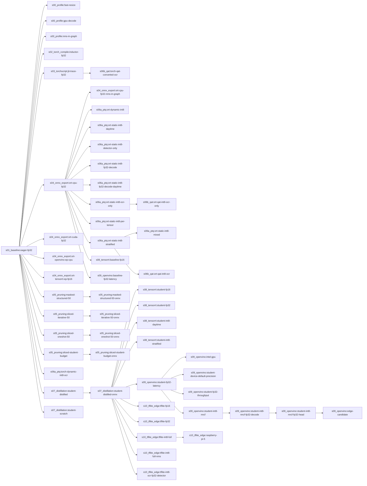

# Journey table

_Generated by `python -m tools.journey_table` from `results/results.json`. Do not edit._

`$/1M frames @ $1/h` = cost per million frames for an instance priced at $1/hour, at the highest-throughput batch whose p95 still meets the SLA. Multiply by your real hourly price — see `src/cost.py`.

## Hardware `3cc807d0` · profile `quick`

**Measured on:** Apple M3 Pro · 18.0 GB RAM · GPU: none · Darwin 25.5.0 arm64 · Python 3.12.12
**Threads:** ANPR_THREADS=4, OMP_NUM_THREADS=4, ORT intra_op_num_threads=4, inter_op=1
**Latency batch size:** 1 · **SLA:** p95 <= 30.0 ms per frame · **Profile:** `quick` · **Validation set sha256:** `aceb33513379`
**Libraries (as loaded by the rows below):** torch 2.13.0, onnxruntime 1.30.0, openvino 2026.3.1, nncf 3.3.0, ai-edge-litert 2.2.0

| row | parent | runtime · device · precision | mAP@0.5 | OCR exact | p50 ms | p95 ms | ≤ SLA | fps (batch) | size MB | peak RSS MB | $/1M frames @ $1/h | status |
|---|---|---|---|---|---|---|---|---|---|---|---|---|
| `s00_profile:fast-resize` | `s01_baseline:eager-fp32` | torch · cpu · fp32 | 0.904 | 0.938 | 52.2 | 54.3 | no | 19.2 (b1) | 37.25 | 1417 | — | ok |
| `s00_profile:gpu-decode` | `s01_baseline:eager-fp32` | torch · cuda · fp32 | — | — | — | — | — | — | — | — | — | not_run: no CUDA device: nvJPEG decode needs an NVIDIA GPU |
| `s00_profile:nms-in-graph` | `s01_baseline:eager-fp32` | torch · cpu · fp32 · NMS in graph | 0.905 | 0.933 | 54.1 | 56.4 | no | 18.5 (b1) | 37.25 | 1395 | — | ok |
| `s01_baseline:eager-fp32` | (root) | torch · cpu · fp32 | 0.905 | 0.933 | 54.1 | 58.3 | no | 18.5 (b1) | 37.25 | 1316 | — | ok |
| `s02_torch_compile:inductor-fp32` | `s01_baseline:eager-fp32` | torch · cpu · fp32 | 0.905 | 0.933 | 50.1 | 53.0 | no | 20.1 (b1) | 37.25 | 1221 | — | ok |
| `s03_torchscript:jit-trace-fp32` | `s01_baseline:eager-fp32` | torchscript · cpu · fp32 | 0.905 | 0.933 | 54.3 | 61.0 | no | 18.3 (b1) | 37.49 | 1323 | — | ok |
| `s04_onnx_export:ort-cpu-fp32` | `s01_baseline:eager-fp32` | ort · cpu · fp32 | 0.905 | 0.933 | 105.8 | 133.8 | no | 10.2 (b8) | 37.46 | 578 | — | ok |
| `s04_onnx_export:ort-cpu-fp32-nms-in-graph` | `s04_onnx_export:ort-cpu-fp32` | ort · cpu · fp32 · NMS in graph | 0.905 | 0.933 | 100.5 | 124.7 | no | 10.4 (b8) | 37.50 | 621 | — | ok |
| `s04_onnx_export:ort-cuda-fp32` | `s01_baseline:eager-fp32` | ort · cuda · fp32 | — | — | — | — | — | — | — | — | — | not_run: CUDAExecutionProvider not available (needs onnxruntime-gpu + NVIDIA GPU) |
| `s04_onnx_export:ort-openvino-ep-cpu` | `s01_baseline:eager-fp32` | ort · cpu · fp32 | — | — | — | — | — | — | — | — | — | not_run: OpenVINOExecutionProvider not available (install onnxruntime-openvino in its own venv; it  |
| `s04_onnx_export:ort-tensorrt-ep-fp16` | `s01_baseline:eager-fp32` | ort · cuda · fp16 | — | — | — | — | — | — | — | — | — | not_run: TensorrtExecutionProvider not available (onnxruntime-gpu + TensorRT 10 libs) |
| `s05_pruning:masked-structured-50` | `s01_baseline:eager-fp32` | torch · cpu · fp32 | 0.897 | 0.934 | 57.3 | 69.8 | no | 18.3 (b1) | 37.25 | 1227 | — | ok |
| `s05_pruning:masked-structured-50-onnx` | `s05_pruning:masked-structured-50` | ort · cpu · fp32 | 0.897 | 0.934 | 100.7 | 110.2 | no | 10.5 (b8) | 37.46 | 716 | — | ok |
| `s05_pruning:sliced-iterative-50` | `s01_baseline:eager-fp32` | torch · cpu · fp32 | 0.913 | 0.933 | 30.4 | 32.8 | no | 32.6 (b4) | 13.10 | 1023 | — | ok |
| `s05_pruning:sliced-iterative-50-onnx` | `s05_pruning:sliced-iterative-50` | ort · cpu · fp32 | 0.913 | 0.933 | 37.6 | 41.8 | no | 29.9 (b8) | 13.29 | 494 | — | ok |
| `s05_pruning:sliced-oneshot-50` | `s01_baseline:eager-fp32` | torch · cpu · fp32 | 0.919 | 0.930 | 29.9 | 43.7 | no | 36.0 (b1) | 13.10 | 980 | — | ok |
| `s05_pruning:sliced-oneshot-50-onnx` | `s05_pruning:sliced-oneshot-50` | ort · cpu · fp32 | 0.919 | 0.930 | 35.8 | 40.3 | no | 31.0 (b4) | 13.29 | 494 | — | ok |
| `s05_pruning:sliced-student-budget` | `s01_baseline:eager-fp32` | torch · cpu · fp32 | 0.859 | 0.902 | 17.1 | 18.8 | yes | 71.8 (b4) | 6.43 | 982 | 4.645 (b1) | ok |
| `s05_pruning:sliced-student-budget-onnx` | `s05_pruning:sliced-student-budget` | ort · cpu · fp32 | 0.859 | 0.902 | 15.8 | 20.1 | yes | 80.2 (b8) | 6.64 | 343 | 4.448 (b1) | ok |
| `s06a_ptq:ort-dynamic-int8` | `s04_onnx_export:ort-cpu-fp32` | ort · cpu · int8-dyn | 0.905 | 0.936 | 45.6 | 48.3 | no | 22.5 (b4) | 11.68 | 768 | — | ok |
| `s06a_ptq:ort-static-int8-daytime` | `s04_onnx_export:ort-cpu-fp32` | ort · cpu · int8 | 0.899 | 0.871 | 34.3 | 44.1 | no | 31.8 (b8) | 11.79 | 308 | — | ok |
| `s06a_ptq:ort-static-int8-detector-only` | `s04_onnx_export:ort-cpu-fp32` | ort · cpu · int8-det | 0.892 | 0.853 | 33.1 | 37.3 | no | 32.5 (b4) | 13.33 | 383 | — | ok |
| `s06a_ptq:ort-static-int8-fp32-decode` | `s04_onnx_export:ort-cpu-fp32` | ort · cpu · int8 | 0.904 | 0.931 | 33.9 | 43.8 | no | 33.0 (b8) | 11.81 | 326 | — | ok |
| `s06a_ptq:ort-static-int8-fp32-decode-daytime` | `s04_onnx_export:ort-cpu-fp32` | ort · cpu · int8 | 0.905 | 0.930 | 32.7 | 35.8 | no | 32.7 (b4) | 11.81 | 319 | — | ok |
| `s06a_ptq:ort-static-int8-mixed` | `s06a_ptq:ort-static-int8-stratified` | ort · cpu · int8-mixed | 0.906 | 0.934 | 39.2 | 43.0 | no | 27.7 (b8) | 12.14 | 684 | — | ok |
| `s06a_ptq:ort-static-int8-ocr-only` | `s04_onnx_export:ort-cpu-fp32` | ort · cpu · int8-ocr | 0.905 | 0.933 | 95.6 | 99.1 | no | 11.1 (b4) | 35.93 | 679 | — | ok |
| `s06a_ptq:ort-static-int8-per-tensor` | `s04_onnx_export:ort-cpu-fp32` | ort · cpu · int8 | 0.893 | 0.855 | 32.4 | 35.4 | no | 33.9 (b8) | 11.72 | 314 | — | ok |
| `s06a_ptq:ort-static-int8-stratified` | `s04_onnx_export:ort-cpu-fp32` | ort · cpu · int8 | 0.892 | 0.854 | 32.6 | 35.9 | no | 33.6 (b8) | 11.79 | 366 | — | ok |
| `s06a_ptq:torch-dynamic-int8-ocr` | `s01_baseline:eager-fp32` | torch · cpu · int8-dyn | 0.905 | 0.932 | 55.1 | 57.1 | no | 18.1 (b1) | 35.19 | 1285 | — | ok |
| `s06b_qat:ort-qat-int8-ocr` | `s06a_ptq:ort-static-int8-stratified` | ort · cpu · int8-qat | — | — | — | — | — | — | — | — | — | failed: libc++abi: terminating due to uncaught exception of type std::__1::system_error: recursive |
| `s06b_qat:ort-qat-int8-ocr-only` | `s06a_ptq:ort-static-int8-ocr-only` | ort · cpu · int8-qat | 0.905 | 0.930 | 97.2 | 101.6 | no | 11.0 (b8) | 37.37 | 679 | — | ok |
| `s06b_qat:torch-qat-converted-ocr` | `s03_torchscript:jit-trace-fp32` | torchscript · cpu · int8-qat | 0.905 | 0.930 | 55.6 | 68.1 | no | 18.5 (b1) | 35.93 | 1204 | — | ok |
| `s07_distillation:student-distilled` | `s01_baseline:eager-fp32` | torch · cpu · fp32 | 0.898 | 0.947 | 28.8 | 30.7 | no | 53.6 (b8) | 2.46 | 625 | 8.026 (b1) | ok |
| `s07_distillation:student-distilled-onnx` | `s07_distillation:student-distilled` | ort · cpu · fp32 | 0.898 | 0.947 | 16.4 | 19.3 | yes | 69.2 (b4) | 2.68 | 467 | 4.464 (b1) | ok |
| `s07_distillation:student-scratch` | `s01_baseline:eager-fp32` | torch · cpu · fp32 | 0.900 | 0.932 | 28.8 | 31.0 | no | 54.1 (b8) | 2.46 | 766 | 8.038 (b1) | ok |
| `s08_tensorrt:baseline-fp16` | `s04_onnx_export:ort-cpu-fp32` | tensorrt · cuda · fp16 | — | — | — | — | — | — | — | — | — | not_run: no CUDA device: TensorRT engines are built for, and run on, an NVIDIA GPU |
| `s08_tensorrt:student-fp16` | `s07_distillation:student-distilled-onnx` | tensorrt · cuda · fp16 | — | — | — | — | — | — | — | — | — | not_run: no CUDA device: TensorRT engines are built for, and run on, an NVIDIA GPU |
| `s08_tensorrt:student-fp32` | `s07_distillation:student-distilled-onnx` | tensorrt · cuda · fp32 | — | — | — | — | — | — | — | — | — | not_run: no CUDA device: TensorRT engines are built for, and run on, an NVIDIA GPU |
| `s08_tensorrt:student-int8-daytime` | `s07_distillation:student-distilled-onnx` | tensorrt · cuda · int8 | — | — | — | — | — | — | — | — | — | not_run: no CUDA device: TensorRT engines are built for, and run on, an NVIDIA GPU |
| `s08_tensorrt:student-int8-stratified` | `s07_distillation:student-distilled-onnx` | tensorrt · cuda · int8 | — | — | — | — | — | — | — | — | — | not_run: no CUDA device: TensorRT engines are built for, and run on, an NVIDIA GPU |
| `s09_openvino:baseline-fp32-latency` | `s04_onnx_export:ort-cpu-fp32` | openvino · cpu · fp32 | 0.905 | 0.933 | 49.1 | 54.6 | no | 22.3 (b4) | 37.27 | 2956 | — | ok |
| `s09_openvino:edge-candidate` | `s09_openvino:student-int8-nncf-fp32-head` | openvino · cpu · int8 · NMS in graph | 0.804 | 0.868 | 8.2 | 9.9 | yes | 131.2 (b8) | 1.06 | 598 | 2.278 (b1) | ok |
| `s09_openvino:intel-gpu` | `s09_openvino:student-fp32-latency` | openvino · gpu · fp32 | — | — | — | — | — | — | — | — | — | not_run: no OpenVINO GPU device (available: ['CPU']); the GPU plugin targets Intel GPUs |
| `s09_openvino:student-device-default-precision` | `s09_openvino:student-fp32-latency` | openvino · cpu · device-default | 0.898 | 0.942 | 8.8 | 10.4 | yes | 119.9 (b4) | 2.53 | 539 | 2.459 (b1) | ok |
| `s09_openvino:student-fp32-latency` | `s07_distillation:student-distilled-onnx` | openvino · cpu · fp32 | 0.898 | 0.947 | 10.1 | 12.1 | yes | 102.8 (b4) | 2.53 | 772 | — | ok |
| `s09_openvino:student-fp32-throughput` | `s09_openvino:student-fp32-latency` | openvino · cpu · fp32 | 0.898 | 0.947 | 21.2 | 23.4 | yes | 77.2 (b8) | 2.53 | 558 | 5.876 (b1) | ok |
| `s09_openvino:student-int8-nncf` | `s09_openvino:student-fp32-latency` | openvino · cpu · int8 | 0.893 | 0.732 | 10.6 | 12.3 | yes | 101.4 (b4) | 1.01 | 603 | 3.016 (b1) | ok |
| `s09_openvino:student-int8-nncf-fp32-decode` | `s09_openvino:student-int8-nncf` | openvino · cpu · int8 | 0.895 | 0.739 | 10.6 | 12.2 | yes | 101.3 (b4) | 1.02 | 605 | 2.959 (b1) | ok |
| `s09_openvino:student-int8-nncf-fp32-head` | `s09_openvino:student-int8-nncf-fp32-decode` | openvino · cpu · int8 | 0.895 | 0.934 | 10.7 | 12.3 | yes | 100.4 (b4) | 1.02 | 605 | 2.925 (b1) | ok |
| `s10_tflite_edge:raspberry-pi-5` | `s10_tflite_edge:tflite-int8-full` | tflite · cpu · int8 | — | — | — | — | — | — | — | — | — | not_run: not measured on a Raspberry Pi: on the device, run `make setup-edge data && make s10` — th |
| `s10_tflite_edge:tflite-fp16` | `s07_distillation:student-distilled-onnx` | tflite · cpu · fp16 | — | — | — | — | — | — | — | — | — | failed: LiteRT cannot load the converted file: {'detector': 'tflite/kernels/conv.cc:360 input_type |
| `s10_tflite_edge:tflite-fp32` | `s07_distillation:student-distilled-onnx` | tflite · cpu · fp32 | 0.898 | 0.947 | 14.5 | 16.2 | yes | 68.7 (b4) | 2.42 | 228 | 4.073 (b1) | ok |
| `s10_tflite_edge:tflite-int8-full` | `s07_distillation:student-distilled-onnx` | tflite · cpu · int8 | — | — | — | — | — | — | — | — | — | failed: onnx2tf did not produce the file: {'detector': 'StrictFullIntegerQuantizationError: Unsupp |
| `s10_tflite_edge:tflite-int8-full-nms` | `s07_distillation:student-distilled-onnx` | tflite · cpu · int8 · NMS in graph | — | — | — | — | — | — | — | — | — | failed: onnx2tf did not produce the file: {'detector': 'StrictFullIntegerQuantizationError: Unsupp |
| `s10_tflite_edge:tflite-int8-ocr-fp32-detector` | `s07_distillation:student-distilled-onnx` | tflite · cpu · int8-ocr | 0.898 | 0.947 | 14.3 | 16.0 | yes | 69.2 (b4) | 1.94 | 230 | 4.105 (b1) | ok |

Lineage: which artifact each row was built from

